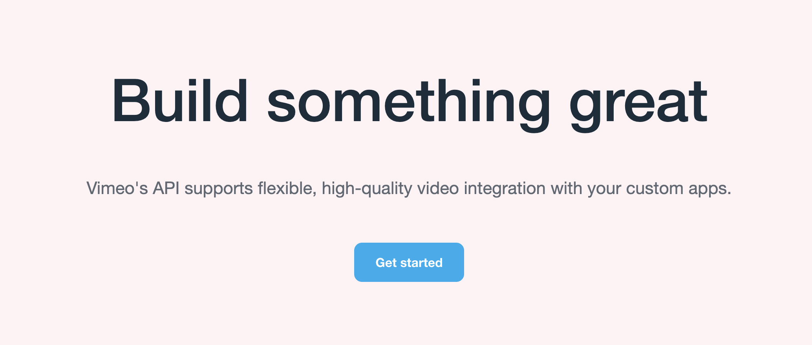

<div align="left">

[](https://developer.vimeo.com)

# [Vimeo](https://developer.vimeo.com)

Build something great. Vimeo's API supports flexible, high-quality video integration with your custom apps.

</div>

## Requirements

Building the API client library requires:

1. Java 1.8+
2. Maven (3.8.3+)/Gradle (7.2+)

If you are adding this library to an Android Application or Library:

3. Android 8.0+ (API Level 26+)

## Installation<a id="installation"></a>
<div align="center">
  <a href="https://konfigthis.com/sdk-sign-up?company=Vimeo&language=Java">
    
  </a>
</div>

### Maven users

Add this dependency to your project's POM:

```xml
<dependency>
  <groupId>com.konfigthis</groupId>
  <artifactId>vimeo-java-sdk</artifactId>
  <version>3.4</version>
  <scope>compile</scope>
</dependency>
```

### Gradle users

Add this dependency to your `build.gradle`:

```groovy
// build.gradle
repositories {
  mavenCentral()
}

dependencies {
   implementation "com.konfigthis:vimeo-java-sdk:3.4"
}
```

### Android users

Make sure your `build.gradle` file as a `minSdk` version of at least 26:
```groovy
// build.gradle
android {
    defaultConfig {
        minSdk 26
    }
}
```

Also make sure your library or application has internet permissions in your `AndroidManifest.xml`:

```xml
<!--AndroidManifest.xml-->
<?xml version="1.0" encoding="utf-8"?>
<manifest xmlns:android="http://schemas.android.com/apk/res/android"
    xmlns:tools="http://schemas.android.com/tools">
    <uses-permission android:name="android.permission.INTERNET"/>
</manifest>
```

### Others

At first generate the JAR by executing:

```shell
mvn clean package
```

Then manually install the following JARs:

* `target/vimeo-java-sdk-3.4.jar`
* `target/lib/*.jar`

## Getting Started

Please follow the [installation](#installation) instruction and execute the following Java code:

```java
import com.konfigthis.client.ApiClient;
import com.konfigthis.client.ApiException;
import com.konfigthis.client.ApiResponse;
import com.konfigthis.client.Vimeo;
import com.konfigthis.client.Configuration;
import com.konfigthis.client.auth.*;
import com.konfigthis.client.model.*;
import com.konfigthis.client.api.ApiInformationEssentialsApi;
import java.util.List;
import java.util.Map;
import java.util.UUID;

public class Example {
  public static void main(String[] args) {
    Configuration configuration = new Configuration();
    configuration.host = "https://api.vimeo.com";
    // Configure OAuth2 client credentials for "application" OAuth flow
    String clientId = System.getenv("CLIENT_ID");
    String clientSecret = System.getenv("CLIENT_SECRET");
    configuration.clientId = "clientId";
    configuration.clientSecret = "clientSecret";
    
    
    // Configure OAuth2 access token for authorization: oauth2
    configuration.accessToken = "YOUR ACCESS TOKEN";
    Vimeo client = new Vimeo(configuration);
    Boolean openapi = true; // Return an OpenAPI specification.
    String version = "3.4"; // Return an OpenAPI specification for the specified API version. This overwrites the **version** field provided in the **Accept** header.
    try {
      Endpoint result = client
              .apiInformationEssentials
              .endpoints()
              .openapi(openapi)
              .version(version)
              .execute();
      System.out.println(result);
      System.out.println(result.getMethods());
      System.out.println(result.getPath());
    } catch (ApiException e) {
      System.err.println("Exception when calling ApiInformationEssentialsApi#endpoints");
      System.err.println("Status code: " + e.getStatusCode());
      System.err.println("Reason: " + e.getResponseBody());
      System.err.println("Response headers: " + e.getResponseHeaders());
      e.printStackTrace();
    }

    // Use .executeWithHttpInfo() to retrieve HTTP Status Code, Headers and Request
    try {
      ApiResponse<Endpoint> response = client
              .apiInformationEssentials
              .endpoints()
              .openapi(openapi)
              .version(version)
              .executeWithHttpInfo();
      System.out.println(response.getResponseBody());
      System.out.println(response.getResponseHeaders());
      System.out.println(response.getStatusCode());
      System.out.println(response.getRoundTripTime());
      System.out.println(response.getRequest());
    } catch (ApiException e) {
      System.err.println("Exception when calling ApiInformationEssentialsApi#endpoints");
      System.err.println("Status code: " + e.getStatusCode());
      System.err.println("Reason: " + e.getResponseBody());
      System.err.println("Response headers: " + e.getResponseHeaders());
      e.printStackTrace();
    }
  }
}

```

## Documentation for API Endpoints

All URIs are relative to *https://api.vimeo.com*

Class | Method | HTTP request | Description
------------ | ------------- | ------------- | -------------
*ApiInformationEssentialsApi* | [**endpoints**](docs/ApiInformationEssentialsApi.md#endpoints) | **GET** / | Get the API specification
*AuthenticationExtrasAuthenticateApi* | [**auth**](docs/AuthenticationExtrasAuthenticateApi.md#auth) | **POST** /oauth/authorize/client | Authorize a client with OAuth
*AuthenticationExtrasConvertApi* | [**oAuth1ToOAuth2**](docs/AuthenticationExtrasConvertApi.md#oAuth1ToOAuth2) | **POST** /oauth/authorize/vimeo_oauth1 | Convert an OAuth 1 access token to an OAuth 2 access token
*AuthenticationExtrasEssentialsApi* | [**token**](docs/AuthenticationExtrasEssentialsApi.md#token) | **GET** /oauth/verify | Verify an OAuth 2 access token
*AuthenticationExtrasEssentialsApi* | [**token_0**](docs/AuthenticationExtrasEssentialsApi.md#token_0) | **DELETE** /tokens | Revoke the current access token
*AuthenticationExtrasExchangeApi* | [**oAuthCodeExchange**](docs/AuthenticationExtrasExchangeApi.md#oAuthCodeExchange) | **POST** /oauth/access_token | Exchange an authorization code for an access token
*CategoriesChannelsApi* | [**listInCategory**](docs/CategoriesChannelsApi.md#listInCategory) | **GET** /categories/{category}/channels | Get all the channels in a category
*CategoriesEssentialsApi* | [**categories**](docs/CategoriesEssentialsApi.md#categories) | **GET** /categories | Get all categories
*CategoriesEssentialsApi* | [**category**](docs/CategoriesEssentialsApi.md#category) | **GET** /categories/{category} | Get a specific category
*CategoriesGroupsApi* | [**getAllGroups**](docs/CategoriesGroupsApi.md#getAllGroups) | **GET** /categories/{category}/groups | Get all the groups in a category
*CategoriesUsersApi* | [**checkFollowedCategory**](docs/CategoriesUsersApi.md#checkFollowedCategory) | **GET** /me/categories/{category} | Check if the user follows a category
*CategoriesUsersApi* | [**checkFollowedCategory_0**](docs/CategoriesUsersApi.md#checkFollowedCategory_0) | **GET** /users/{user_id}/categories/{category} | Check if the user follows a category
*CategoriesUsersApi* | [**followCategory**](docs/CategoriesUsersApi.md#followCategory) | **PUT** /me/categories/{category} | Cause the user to follow a specific category
*CategoriesUsersApi* | [**followSpecificCategory**](docs/CategoriesUsersApi.md#followSpecificCategory) | **PUT** /users/{user_id}/categories/{category} | Cause the user to follow a specific category
*CategoriesUsersApi* | [**listFollowedCategories**](docs/CategoriesUsersApi.md#listFollowedCategories) | **GET** /me/categories | Get all the categories that the user follows
*CategoriesUsersApi* | [**listFollowedCategories_0**](docs/CategoriesUsersApi.md#listFollowedCategories_0) | **GET** /users/{user_id}/categories | Get all the categories that the user follows
*CategoriesUsersApi* | [**stopFollowingCategory**](docs/CategoriesUsersApi.md#stopFollowingCategory) | **DELETE** /me/categories/{category} | Cause the user to stop following a category
*CategoriesUsersApi* | [**stopFollowingCategory_0**](docs/CategoriesUsersApi.md#stopFollowingCategory_0) | **DELETE** /users/{user_id}/categories/{category} | Cause the user to stop following a category
*CategoriesVideosApi* | [**getAllVideoCategories**](docs/CategoriesVideosApi.md#getAllVideoCategories) | **GET** /videos/{video_id}/categories | Get all the categories to which a video belongs
*CategoriesVideosApi* | [**getVideoInCategory**](docs/CategoriesVideosApi.md#getVideoInCategory) | **GET** /categories/{category}/videos/{video_id} | Get a specific video in a category
*CategoriesVideosApi* | [**listVideosInCategory**](docs/CategoriesVideosApi.md#listVideosInCategory) | **GET** /categories/{category}/videos | Get all the videos in a category
*CategoriesVideosApi* | [**setVideoCategories**](docs/CategoriesVideosApi.md#setVideoCategories) | **PUT** /videos/{video_id}/categories | Suggest categories for a video
*ChannelsCategoriesApi* | [**addChannelToMultipleCategories**](docs/ChannelsCategoriesApi.md#addChannelToMultipleCategories) | **PUT** /channels/{channel_id}/categories | Add a channel to a list of categories
*ChannelsCategoriesApi* | [**channel**](docs/ChannelsCategoriesApi.md#channel) | **PUT** /channels/{channel_id}/categories/{category} | Add a channel to a specific category
*ChannelsCategoriesApi* | [**getBelongingCategories**](docs/ChannelsCategoriesApi.md#getBelongingCategories) | **GET** /channels/{channel_id}/categories | Get all the categories to which a channel belongs
*ChannelsCategoriesApi* | [**removeChannelFromCategory**](docs/ChannelsCategoriesApi.md#removeChannelFromCategory) | **DELETE** /channels/{channel_id}/categories/{category} | Remove a channel from a category
*ChannelsEssentialsApi* | [**channel**](docs/ChannelsEssentialsApi.md#channel) | **POST** /channels | Create a channel
*ChannelsEssentialsApi* | [**channel_0**](docs/ChannelsEssentialsApi.md#channel_0) | **GET** /channels/{channel_id} | Get a specific channel
*ChannelsEssentialsApi* | [**channel_1**](docs/ChannelsEssentialsApi.md#channel_1) | **DELETE** /channels/{channel_id} | Delete a channel
*ChannelsEssentialsApi* | [**channel_2**](docs/ChannelsEssentialsApi.md#channel_2) | **PATCH** /channels/{channel_id} | Edit a channel
*ChannelsEssentialsApi* | [**channels**](docs/ChannelsEssentialsApi.md#channels) | **GET** /channels | Get all channels
*ChannelsEssentialsApi* | [**getUserSubscriptions**](docs/ChannelsEssentialsApi.md#getUserSubscriptions) | **GET** /me/channels | Get all the channels to which a user subscribes
*ChannelsEssentialsApi* | [**getUserSubscriptions_0**](docs/ChannelsEssentialsApi.md#getUserSubscriptions_0) | **GET** /users/{user_id}/channels | Get all the channels to which a user subscribes
*ChannelsModeratorsApi* | [**addModeratorToChannel**](docs/ChannelsModeratorsApi.md#addModeratorToChannel) | **PUT** /channels/{channel_id}/moderators/{user_id} | Add a specific moderator to a channel
*ChannelsModeratorsApi* | [**bulkAddModerators**](docs/ChannelsModeratorsApi.md#bulkAddModerators) | **PUT** /channels/{channel_id}/moderators | Add a list of moderators to a channel
*ChannelsModeratorsApi* | [**getSpecificModerator**](docs/ChannelsModeratorsApi.md#getSpecificModerator) | **GET** /channels/{channel_id}/moderators/{user_id} | Get a specific moderator of a channel
*ChannelsModeratorsApi* | [**listByChannel**](docs/ChannelsModeratorsApi.md#listByChannel) | **GET** /channels/{channel_id}/moderators | Get all the moderators of a channel
*ChannelsModeratorsApi* | [**removeModerator**](docs/ChannelsModeratorsApi.md#removeModerator) | **DELETE** /channels/{channel_id}/moderators/{user_id} | Remove a specific moderator from a channel
*ChannelsModeratorsApi* | [**removeMultipleFromChannel**](docs/ChannelsModeratorsApi.md#removeMultipleFromChannel) | **DELETE** /channels/{channel_id}/moderators | Remove a list of moderators from a channel
*ChannelsModeratorsApi* | [**replaceModerators**](docs/ChannelsModeratorsApi.md#replaceModerators) | **PATCH** /channels/{channel_id}/moderators | Replace the moderators of a channel
*ChannelsPrivateChannelMembersApi* | [**getAccessibleUsers**](docs/ChannelsPrivateChannelMembersApi.md#getAccessibleUsers) | **GET** /channels/{channel_id}/privacy/users | Get all the users who can access a private channel
*ChannelsPrivateChannelMembersApi* | [**permitUserAccess**](docs/ChannelsPrivateChannelMembersApi.md#permitUserAccess) | **PUT** /channels/{channel_id}/privacy/users | Permit a list of users to access a private channel
*ChannelsPrivateChannelMembersApi* | [**permitUserAccess_0**](docs/ChannelsPrivateChannelMembersApi.md#permitUserAccess_0) | **PUT** /channels/{channel_id}/privacy/users/{user_id} | Permit a specific user to access a private channel
*ChannelsPrivateChannelMembersApi* | [**restrictUserAccess**](docs/ChannelsPrivateChannelMembersApi.md#restrictUserAccess) | **DELETE** /channels/{channel_id}/privacy/users/{user_id} | Restrict a user from accessing a private channel
*ChannelsSubscriptionsAndSubscribersApi* | [**checkIfUserFollowsChannel**](docs/ChannelsSubscriptionsAndSubscribersApi.md#checkIfUserFollowsChannel) | **GET** /me/channels/{channel_id} | Check if a user follows a channel
*ChannelsSubscriptionsAndSubscribersApi* | [**checkUserFollowsChannel**](docs/ChannelsSubscriptionsAndSubscribersApi.md#checkUserFollowsChannel) | **GET** /users/{user_id}/channels/{channel_id} | Check if a user follows a channel
*ChannelsSubscriptionsAndSubscribersApi* | [**listChannelFollowers**](docs/ChannelsSubscriptionsAndSubscribersApi.md#listChannelFollowers) | **GET** /channels/{channel_id}/users | Get all the followers of a channel
*ChannelsSubscriptionsAndSubscribersApi* | [**subscribeToChannel**](docs/ChannelsSubscriptionsAndSubscribersApi.md#subscribeToChannel) | **PUT** /users/{user_id}/channels/{channel_id} | Subscribe the user to a specific channel
*ChannelsSubscriptionsAndSubscribersApi* | [**subscribeUserToChannel**](docs/ChannelsSubscriptionsAndSubscribersApi.md#subscribeUserToChannel) | **PUT** /me/channels/{channel_id} | Subscribe the user to a specific channel
*ChannelsSubscriptionsAndSubscribersApi* | [**unsubscribeUserFromChannel**](docs/ChannelsSubscriptionsAndSubscribersApi.md#unsubscribeUserFromChannel) | **DELETE** /me/channels/{channel_id} | Unsubscribe the user from a specific channel
*ChannelsSubscriptionsAndSubscribersApi* | [**unsubscribeUserFromChannel_0**](docs/ChannelsSubscriptionsAndSubscribersApi.md#unsubscribeUserFromChannel_0) | **DELETE** /users/{user_id}/channels/{channel_id} | Unsubscribe the user from a specific channel
*ChannelsTagsApi* | [**addMultipleTagsToChannel**](docs/ChannelsTagsApi.md#addMultipleTagsToChannel) | **PUT** /channels/{channel_id}/tags | Add a list of tags to a channel
*ChannelsTagsApi* | [**addTagToChannel**](docs/ChannelsTagsApi.md#addTagToChannel) | **PUT** /channels/{channel_id}/tags/{word} | Add a specific tag to a channel
*ChannelsTagsApi* | [**checkIfTagAddedToChannel**](docs/ChannelsTagsApi.md#checkIfTagAddedToChannel) | **GET** /channels/{channel_id}/tags/{word} | Check if a tag has been added to a channel
*ChannelsTagsApi* | [**getAllChannelTags**](docs/ChannelsTagsApi.md#getAllChannelTags) | **GET** /channels/{channel_id}/tags | Get all the tags that have been added to a channel
*ChannelsTagsApi* | [**removeTagFromChannel**](docs/ChannelsTagsApi.md#removeTagFromChannel) | **DELETE** /channels/{channel_id}/tags/{word} | Remove a tag from a channel
*ChannelsVideosApi* | [**addMultipleToChannel**](docs/ChannelsVideosApi.md#addMultipleToChannel) | **PUT** /channels/{channel_id}/videos | Add a list of videos to a channel
*ChannelsVideosApi* | [**addVideoToChannel**](docs/ChannelsVideosApi.md#addVideoToChannel) | **PUT** /channels/{channel_id}/videos/{video_id} | Add a specific video to a channel
*ChannelsVideosApi* | [**getAccessibleChannels**](docs/ChannelsVideosApi.md#getAccessibleChannels) | **GET** /videos/{video_id}/available_channels | Get all the channels to which the user can add or remove a specific video
*ChannelsVideosApi* | [**getSpecificVideoInChannel**](docs/ChannelsVideosApi.md#getSpecificVideoInChannel) | **GET** /channels/{channel_id}/videos/{video_id} | Get a specific video in a channel
*ChannelsVideosApi* | [**listInChannel**](docs/ChannelsVideosApi.md#listInChannel) | **GET** /channels/{channel_id}/videos | Get all the videos in a channel
*ChannelsVideosApi* | [**removeMultipleFromChannel**](docs/ChannelsVideosApi.md#removeMultipleFromChannel) | **DELETE** /channels/{channel_id}/videos | Remove a list of videos from a channel
*ChannelsVideosApi* | [**removeSpecificVideo**](docs/ChannelsVideosApi.md#removeSpecificVideo) | **DELETE** /channels/{channel_id}/videos/{video_id} | Remove a specific video from a channel
*EmbedPresetsCustomLogosApi* | [**addUserLogo**](docs/EmbedPresetsCustomLogosApi.md#addUserLogo) | **POST** /me/customlogos | Add a custom user logo
*EmbedPresetsCustomLogosApi* | [**addUserLogo_0**](docs/EmbedPresetsCustomLogosApi.md#addUserLogo_0) | **POST** /users/{user_id}/customlogos | Add a custom user logo
*EmbedPresetsCustomLogosApi* | [**deleteUserLogo**](docs/EmbedPresetsCustomLogosApi.md#deleteUserLogo) | **DELETE** /me/customlogos/{logo_id} | Delete a custom user logo
*EmbedPresetsCustomLogosApi* | [**deleteUserLogo_0**](docs/EmbedPresetsCustomLogosApi.md#deleteUserLogo_0) | **DELETE** /users/{user_id}/customlogos/{logo_id} | Delete a custom user logo
*EmbedPresetsCustomLogosApi* | [**getSpecificUserLogo**](docs/EmbedPresetsCustomLogosApi.md#getSpecificUserLogo) | **GET** /me/customlogos/{logo_id} | Get a specific custom user logo
*EmbedPresetsCustomLogosApi* | [**getSpecificUserLogo_0**](docs/EmbedPresetsCustomLogosApi.md#getSpecificUserLogo_0) | **GET** /users/{user_id}/customlogos/{logo_id} | Get a specific custom user logo
*EmbedPresetsCustomLogosApi* | [**list**](docs/EmbedPresetsCustomLogosApi.md#list) | **GET** /me/customlogos | Get all the custom logos that belong to the user
*EmbedPresetsCustomLogosApi* | [**listUserLogos**](docs/EmbedPresetsCustomLogosApi.md#listUserLogos) | **GET** /users/{user_id}/customlogos | Get all the custom logos that belong to the user
*EmbedPresetsEssentialsApi* | [**createEmbedPreset**](docs/EmbedPresetsEssentialsApi.md#createEmbedPreset) | **POST** /users/{user_id}/presets | Create an embed preset
*EmbedPresetsEssentialsApi* | [**createPreset**](docs/EmbedPresetsEssentialsApi.md#createPreset) | **POST** /me/presets | Create an embed preset
*EmbedPresetsEssentialsApi* | [**editPreset**](docs/EmbedPresetsEssentialsApi.md#editPreset) | **PATCH** /me/presets/{preset_id} | Edit an embed preset
*EmbedPresetsEssentialsApi* | [**editPreset_0**](docs/EmbedPresetsEssentialsApi.md#editPreset_0) | **PATCH** /users/{user_id}/presets/{preset_id} | Edit an embed preset
*EmbedPresetsEssentialsApi* | [**getAllUserCreatedEmbedPresets**](docs/EmbedPresetsEssentialsApi.md#getAllUserCreatedEmbedPresets) | **GET** /me/presets | Get all the embed presets that a user has created
*EmbedPresetsEssentialsApi* | [**getSpecificEmbedPreset**](docs/EmbedPresetsEssentialsApi.md#getSpecificEmbedPreset) | **GET** /users/{user_id}/presets/{preset_id} | Get a specific embed preset
*EmbedPresetsEssentialsApi* | [**getSpecificPreset**](docs/EmbedPresetsEssentialsApi.md#getSpecificPreset) | **GET** /me/presets/{preset_id} | Get a specific embed preset
*EmbedPresetsEssentialsApi* | [**getUserEmbedPresets**](docs/EmbedPresetsEssentialsApi.md#getUserEmbedPresets) | **GET** /users/{user_id}/presets | Get all the embed presets that a user has created
*EmbedPresetsTimelineEventsApi* | [**addThumbnailToVideo**](docs/EmbedPresetsTimelineEventsApi.md#addThumbnailToVideo) | **POST** /videos/{video_id}/timelinethumbnails | Add a timeline event thumbnail to a video
*EmbedPresetsTimelineEventsApi* | [**getSingleThumbnail**](docs/EmbedPresetsTimelineEventsApi.md#getSingleThumbnail) | **GET** /videos/{video_id}/timelinethumbnails/{thumbnail_id} | Get a timeline event thumbnail
*EmbedPresetsVideosApi* | [**addPresetToVideo**](docs/EmbedPresetsVideosApi.md#addPresetToVideo) | **PUT** /videos/{video_id}/presets/{preset_id} | Add an embed preset to a video
*EmbedPresetsVideosApi* | [**checkIfPresetAddedToVideo**](docs/EmbedPresetsVideosApi.md#checkIfPresetAddedToVideo) | **GET** /videos/{video_id}/presets/{preset_id} | Check if an embed preset has been added to a video
*EmbedPresetsVideosApi* | [**getPresetVideos**](docs/EmbedPresetsVideosApi.md#getPresetVideos) | **GET** /users/{user_id}/presets/{preset_id}/videos | Get all the videos that have a specific embed preset
*EmbedPresetsVideosApi* | [**getSpecificPresetVideos**](docs/EmbedPresetsVideosApi.md#getSpecificPresetVideos) | **GET** /me/presets/{preset_id}/videos | Get all the videos that have a specific embed preset
*EmbedPresetsVideosApi* | [**removePresetFromVideo**](docs/EmbedPresetsVideosApi.md#removePresetFromVideo) | **DELETE** /videos/{video_id}/presets/{preset_id} | Remove an embed preset from a video
*FoldersEssentialsApi* | [**createFolder**](docs/FoldersEssentialsApi.md#createFolder) | **POST** /me/projects | Create a folder
*FoldersEssentialsApi* | [**deleteFolder**](docs/FoldersEssentialsApi.md#deleteFolder) | **DELETE** /me/projects/{project_id} | Delete a folder
*FoldersEssentialsApi* | [**editFolder**](docs/FoldersEssentialsApi.md#editFolder) | **PATCH** /me/projects/{project_id} | Edit a folder
*FoldersEssentialsApi* | [**getAllUserFolders**](docs/FoldersEssentialsApi.md#getAllUserFolders) | **GET** /me/projects | Get all the folders that belong to the user
*FoldersEssentialsApi* | [**getSpecificFolder**](docs/FoldersEssentialsApi.md#getSpecificFolder) | **GET** /me/projects/{project_id} | Get a specific folder
*FoldersEssentialsApi* | [**getUserPrivateToMeFolder**](docs/FoldersEssentialsApi.md#getUserPrivateToMeFolder) | **GET** /users/{owner_id}/folders/private_to_me | Get a user&#39;s private-to-me folder
*FoldersEssentialsApi* | [**project**](docs/FoldersEssentialsApi.md#project) | **POST** /users/{user_id}/projects | Create a folder
*FoldersEssentialsApi* | [**project_0**](docs/FoldersEssentialsApi.md#project_0) | **GET** /users/{user_id}/projects/{project_id} | Get a specific folder
*FoldersEssentialsApi* | [**project_1**](docs/FoldersEssentialsApi.md#project_1) | **DELETE** /users/{user_id}/projects/{project_id} | Delete a folder
*FoldersEssentialsApi* | [**project_2**](docs/FoldersEssentialsApi.md#project_2) | **PATCH** /users/{user_id}/projects/{project_id} | Edit a folder
*FoldersEssentialsApi* | [**projects**](docs/FoldersEssentialsApi.md#projects) | **GET** /users/{user_id}/projects | Get all the folders that belong to the user
*FoldersItemsApi* | [**getFolderContents**](docs/FoldersItemsApi.md#getFolderContents) | **GET** /users/{user_id}/projects/{project_id}/items | Get all the items in a folder
*FoldersItemsApi* | [**getFolderItems**](docs/FoldersItemsApi.md#getFolderItems) | **GET** /me/projects/{project_id}/items | Get all the items in a folder
*FoldersItemsApi* | [**removeFromFolder**](docs/FoldersItemsApi.md#removeFromFolder) | **DELETE** /me/projects/{project_id}/items | Remove items from a folder
*FoldersVideosApi* | [**addMultipleToFolder**](docs/FoldersVideosApi.md#addMultipleToFolder) | **PUT** /me/projects/{project_id}/videos | Add a list of videos to a folder
*FoldersVideosApi* | [**addSingleFolderVideo**](docs/FoldersVideosApi.md#addSingleFolderVideo) | **PUT** /users/{user_id}/projects/{project_id}/videos/{video_id} | Add a video to a folder
*FoldersVideosApi* | [**addToFolder**](docs/FoldersVideosApi.md#addToFolder) | **PUT** /me/projects/{project_id}/videos/{video_id} | Add a video to a folder
*FoldersVideosApi* | [**addToFolderVideos**](docs/FoldersVideosApi.md#addToFolderVideos) | **PUT** /users/{user_id}/projects/{project_id}/videos | Add a list of videos to a folder
*FoldersVideosApi* | [**getAllFolderVideos**](docs/FoldersVideosApi.md#getAllFolderVideos) | **GET** /users/{user_id}/projects/{project_id}/videos | Get all the videos in a folder
*FoldersVideosApi* | [**getVideosInFolder**](docs/FoldersVideosApi.md#getVideosInFolder) | **GET** /me/projects/{project_id}/videos | Get all the videos in a folder
*FoldersVideosApi* | [**removeFromFolderVideo**](docs/FoldersVideosApi.md#removeFromFolderVideo) | **DELETE** /users/{user_id}/projects/{project_id}/videos/{video_id} | Remove a video from a folder
*FoldersVideosApi* | [**removeMultipleFromFolder**](docs/FoldersVideosApi.md#removeMultipleFromFolder) | **DELETE** /me/projects/{project_id}/videos | Remove a list of videos from a folder
*FoldersVideosApi* | [**removeMultipleVideosFromFolder**](docs/FoldersVideosApi.md#removeMultipleVideosFromFolder) | **DELETE** /users/{user_id}/projects/{project_id}/videos | Remove a list of videos from a folder
*FoldersVideosApi* | [**removeSingleVideo**](docs/FoldersVideosApi.md#removeSingleVideo) | **DELETE** /me/projects/{project_id}/videos/{video_id} | Remove a video from a folder
*GroupsEssentialsApi* | [**group**](docs/GroupsEssentialsApi.md#group) | **POST** /groups | Create a group
*GroupsEssentialsApi* | [**group_0**](docs/GroupsEssentialsApi.md#group_0) | **GET** /groups/{group_id} | Get a specific group
*GroupsEssentialsApi* | [**group_1**](docs/GroupsEssentialsApi.md#group_1) | **DELETE** /groups/{group_id} | Delete a group
*GroupsEssentialsApi* | [**groups**](docs/GroupsEssentialsApi.md#groups) | **GET** /groups | Get all groups
*GroupsSubscriptionsApi* | [**addUserToGroup**](docs/GroupsSubscriptionsApi.md#addUserToGroup) | **PUT** /me/groups/{group_id} | Add the user to a group
*GroupsSubscriptionsApi* | [**group**](docs/GroupsSubscriptionsApi.md#group) | **PUT** /users/{user_id}/groups/{group_id} | Add the user to a group
*GroupsSubscriptionsApi* | [**group_0**](docs/GroupsSubscriptionsApi.md#group_0) | **DELETE** /users/{user_id}/groups/{group_id} | Remove the user from a group
*GroupsSubscriptionsApi* | [**removeUserFromGroup**](docs/GroupsSubscriptionsApi.md#removeUserFromGroup) | **DELETE** /me/groups/{group_id} | Remove the user from a group
*GroupsUsersApi* | [**checkBelongGroup**](docs/GroupsUsersApi.md#checkBelongGroup) | **GET** /users/{user_id}/groups/{group_id} | Check if a user has joined a group
*GroupsUsersApi* | [**checkUserJoinedGroup**](docs/GroupsUsersApi.md#checkUserJoinedGroup) | **GET** /me/groups/{group_id} | Check if a user has joined a group
*GroupsUsersApi* | [**getGroupUsers**](docs/GroupsUsersApi.md#getGroupUsers) | **GET** /groups/{group_id}/users | Get all the members of a group
*GroupsUsersApi* | [**getUserGroups**](docs/GroupsUsersApi.md#getUserGroups) | **GET** /me/groups | Get all the groups that the user has joined
*GroupsUsersApi* | [**getUserGroupsList**](docs/GroupsUsersApi.md#getUserGroupsList) | **GET** /users/{user_id}/groups | Get all the groups that the user has joined
*GroupsVideosApi* | [**addToGroup**](docs/GroupsVideosApi.md#addToGroup) | **PUT** /groups/{group_id}/videos/{video_id} | Add a video to a group
*GroupsVideosApi* | [**getAllGroupVideos**](docs/GroupsVideosApi.md#getAllGroupVideos) | **GET** /groups/{group_id}/videos | Get all the videos in a group
*GroupsVideosApi* | [**getSingleVideo**](docs/GroupsVideosApi.md#getSingleVideo) | **GET** /groups/{group_id}/videos/{video_id} | Get a specific video in a group
*GroupsVideosApi* | [**removeFromGroup**](docs/GroupsVideosApi.md#removeFromGroup) | **DELETE** /groups/{group_id}/videos/{video_id} | Remove a video from a group
*LikesEssentialsApi* | [**checkUserLikedVideo**](docs/LikesEssentialsApi.md#checkUserLikedVideo) | **GET** /me/likes/{video_id} | Check if the user has liked a video
*LikesEssentialsApi* | [**checkVideoLikedByUser**](docs/LikesEssentialsApi.md#checkVideoLikedByUser) | **GET** /users/{user_id}/likes/{video_id} | Check if the user has liked a video
*LikesEssentialsApi* | [**getAllUserLikes**](docs/LikesEssentialsApi.md#getAllUserLikes) | **GET** /ondemand/pages/{ondemand_id}/likes | Get all the users who have liked a video on an On Demand page
*LikesEssentialsApi* | [**getUserLikedVideos**](docs/LikesEssentialsApi.md#getUserLikedVideos) | **GET** /me/likes | Get all the videos that a user has liked
*LikesEssentialsApi* | [**getUserLikes**](docs/LikesEssentialsApi.md#getUserLikes) | **GET** /videos/{video_id}/likes | Get all the users who have liked a video
*LikesEssentialsApi* | [**getUsersWhoLikedVideo**](docs/LikesEssentialsApi.md#getUsersWhoLikedVideo) | **GET** /channels/{channel_id}/videos/{video_id}/likes | Get all the users who have liked a video
*LikesEssentialsApi* | [**likeVideo**](docs/LikesEssentialsApi.md#likeVideo) | **PUT** /me/likes/{video_id} | Cause the user to like a video
*LikesEssentialsApi* | [**likes**](docs/LikesEssentialsApi.md#likes) | **GET** /users/{user_id}/likes | Get all the videos that a user has liked
*LikesEssentialsApi* | [**unlikeVideo**](docs/LikesEssentialsApi.md#unlikeVideo) | **DELETE** /me/likes/{video_id} | Cause a user to unlike a video
*LikesEssentialsApi* | [**video**](docs/LikesEssentialsApi.md#video) | **PUT** /users/{user_id}/likes/{video_id} | Cause the user to like a video
*LikesEssentialsApi* | [**video_0**](docs/LikesEssentialsApi.md#video_0) | **DELETE** /users/{user_id}/likes/{video_id} | Cause a user to unlike a video
*LiveEmbedPrivacyApi* | [**embedEventOnDomains**](docs/LiveEmbedPrivacyApi.md#embedEventOnDomains) | **PUT** /live_events/{live_event_id}/privacy/domains | Embed a live event on one or more domains
*LiveEmbedPrivacyApi* | [**embedEventOnDomains_0**](docs/LiveEmbedPrivacyApi.md#embedEventOnDomains_0) | **PUT** /me/live_events/{live_event_id}/privacy/domains | Embed a live event on one or more domains
*LiveEmbedPrivacyApi* | [**embedEventOnDomains_1**](docs/LiveEmbedPrivacyApi.md#embedEventOnDomains_1) | **PUT** /users/{user_id}/live_events/{live_event_id}/privacy/domains | Embed a live event on one or more domains
*LiveEmbedPrivacyApi* | [**getWhitelistDomains**](docs/LiveEmbedPrivacyApi.md#getWhitelistDomains) | **GET** /live_events/{live_event_id}/privacy/domains | Get all the domains on which a live event can be embedded
*LiveEmbedPrivacyApi* | [**getWhitelistDomains_0**](docs/LiveEmbedPrivacyApi.md#getWhitelistDomains_0) | **GET** /me/live_events/{live_event_id}/privacy/domains | Get all the domains on which a live event can be embedded
*LiveEmbedPrivacyApi* | [**getWhitelistDomains_1**](docs/LiveEmbedPrivacyApi.md#getWhitelistDomains_1) | **GET** /users/{user_id}/live_events/{live_event_id}/privacy/domains | Get all the domains on which a live event can be embedded
*LiveEssentialsApi* | [**createEvent**](docs/LiveEssentialsApi.md#createEvent) | **POST** /live_events | Create a live event
*LiveEssentialsApi* | [**createEventForUser**](docs/LiveEssentialsApi.md#createEventForUser) | **POST** /users/{user_id}/live_events | Create a live event
*LiveEssentialsApi* | [**createLiveEvent**](docs/LiveEssentialsApi.md#createLiveEvent) | **POST** /me/live_events | Create a live event
*LiveEssentialsApi* | [**deleteMultipleEvents**](docs/LiveEssentialsApi.md#deleteMultipleEvents) | **DELETE** /live_events | Delete a list of live events
*LiveEssentialsApi* | [**deleteMultipleEvents_0**](docs/LiveEssentialsApi.md#deleteMultipleEvents_0) | **DELETE** /me/live_events | Delete a list of live events
*LiveEssentialsApi* | [**deleteMultipleEvents_1**](docs/LiveEssentialsApi.md#deleteMultipleEvents_1) | **DELETE** /users/{user_id}/live_events | Delete a list of live events
*LiveEssentialsApi* | [**deleteSingleEvent**](docs/LiveEssentialsApi.md#deleteSingleEvent) | **DELETE** /me/live_events/{live_event_id} | Delete a specific live event
*LiveEssentialsApi* | [**deleteSpecificEvent**](docs/LiveEssentialsApi.md#deleteSpecificEvent) | **DELETE** /users/{user_id}/live_events/{live_event_id} | Delete a specific live event
*LiveEssentialsApi* | [**deleteSpecificLiveEvent**](docs/LiveEssentialsApi.md#deleteSpecificLiveEvent) | **DELETE** /live_events/{live_event_id} | Delete a specific live event
*LiveEssentialsApi* | [**getAllUserLiveEvents**](docs/LiveEssentialsApi.md#getAllUserLiveEvents) | **GET** /me/live_events | Get all the live events that belong to the user
*LiveEssentialsApi* | [**getEventById**](docs/LiveEssentialsApi.md#getEventById) | **GET** /live_events/{live_event_id} | Get a specific live event
*LiveEssentialsApi* | [**getEventById_0**](docs/LiveEssentialsApi.md#getEventById_0) | **GET** /users/{user_id}/live_events/{live_event_id} | Get a specific live event
*LiveEssentialsApi* | [**getSpecificLiveEvent**](docs/LiveEssentialsApi.md#getSpecificLiveEvent) | **GET** /me/live_events/{live_event_id} | Get a specific live event
*LiveEssentialsApi* | [**getUserLiveEvents**](docs/LiveEssentialsApi.md#getUserLiveEvents) | **GET** /live_events | Get all the live events that belong to the user
*LiveEssentialsApi* | [**getUserLiveEvents_0**](docs/LiveEssentialsApi.md#getUserLiveEvents_0) | **GET** /users/{user_id}/live_events | Get all the live events that belong to the user
*LiveEssentialsApi* | [**updateEventBelongingToAuthenticatedUser**](docs/LiveEssentialsApi.md#updateEventBelongingToAuthenticatedUser) | **PATCH** /live_events/{live_event_id} | Update a live event
*LiveEssentialsApi* | [**updateEventBelongingToAuthenticatedUser_0**](docs/LiveEssentialsApi.md#updateEventBelongingToAuthenticatedUser_0) | **PATCH** /me/live_events/{live_event_id} | Update a live event
*LiveEssentialsApi* | [**updateEventBelongingToAuthenticatedUser_1**](docs/LiveEssentialsApi.md#updateEventBelongingToAuthenticatedUser_1) | **PATCH** /users/{user_id}/live_events/{live_event_id} | Update a live event
*LiveEventM3U8PlaybackApi* | [**getUrl**](docs/LiveEventM3U8PlaybackApi.md#getUrl) | **GET** /me/live_events/{live_event_id}/m3u8_playback | Get an M3U8 playback URL for a live event
*LiveEventM3U8PlaybackApi* | [**getUrlForEventStream**](docs/LiveEventM3U8PlaybackApi.md#getUrlForEventStream) | **GET** /users/{user_id}/live_events/{live_event_id}/m3u8_playback | Get an M3U8 playback URL for a live event
*LiveEventActivationApi* | [**createRtmpLinks**](docs/LiveEventActivationApi.md#createRtmpLinks) | **POST** /live_events/{live_event_id}/activate | Activate a live event
*LiveEventActivationApi* | [**createRtmpLinks_0**](docs/LiveEventActivationApi.md#createRtmpLinks_0) | **POST** /me/live_events/{live_event_id}/activate | Activate a live event
*LiveEventActivationApi* | [**createRtmpLinks_1**](docs/LiveEventActivationApi.md#createRtmpLinks_1) | **POST** /users/{user_id}/live_events/{live_event_id}/activate | Activate a live event
*LiveEventAutomatedClosedCaptionsApi* | [**editPreference**](docs/LiveEventAutomatedClosedCaptionsApi.md#editPreference) | **PATCH** /live_events/{live_event_id}/auto_cc | Edit the automated closed captions preference of a live event
*LiveEventAutomatedClosedCaptionsApi* | [**editPreferenceForEvent**](docs/LiveEventAutomatedClosedCaptionsApi.md#editPreferenceForEvent) | **PATCH** /me/live_events/{live_event_id}/auto_cc | Edit the automated closed captions preference of a live event
*LiveEventAutomatedClosedCaptionsApi* | [**editPreferenceForEvent_0**](docs/LiveEventAutomatedClosedCaptionsApi.md#editPreferenceForEvent_0) | **PATCH** /users/{user_id}/live_events/{live_event_id}/auto_cc | Edit the automated closed captions preference of a live event
*LiveEventDestinationsApi* | [**createDestination**](docs/LiveEventDestinationsApi.md#createDestination) | **POST** /me/live_events/{live_event_id}/destinations | Create a live event destination
*LiveEventDestinationsApi* | [**createEventDestination**](docs/LiveEventDestinationsApi.md#createEventDestination) | **POST** /users/{user_id}/live_events/{live_event_id}/destinations | Create a live event destination
*LiveEventDestinationsApi* | [**createOneTimeLiveEventDestination**](docs/LiveEventDestinationsApi.md#createOneTimeLiveEventDestination) | **POST** /me/videos/{video_id}/destinations | Create a one-time live event destination
*LiveEventDestinationsApi* | [**createOneTimeLiveEventDestination_0**](docs/LiveEventDestinationsApi.md#createOneTimeLiveEventDestination_0) | **POST** /users/{user_id}/videos/{video_id}/destinations | Create a one-time live event destination
*LiveEventDestinationsApi* | [**createOttDestination**](docs/LiveEventDestinationsApi.md#createOttDestination) | **POST** /users/{user_id}/live_events/{live_event_id}/ott_destinations | Create a live event OTT destination
*LiveEventDestinationsApi* | [**deleteDestination**](docs/LiveEventDestinationsApi.md#deleteDestination) | **DELETE** /destination/{destination_id} | Delete a live event destination
*LiveEventDestinationsApi* | [**deleteOttDestination**](docs/LiveEventDestinationsApi.md#deleteOttDestination) | **DELETE** /users/{user_id}/live_events/{live_event_id}/ott_destination/{destination_id} | Delete a live event OTT destination
*LiveEventDestinationsApi* | [**getAllAvailableDestinations**](docs/LiveEventDestinationsApi.md#getAllAvailableDestinations) | **GET** /me/destinations | Get all available live event destinations for the user to stream to
*LiveEventDestinationsApi* | [**getAllAvailableDestinations_0**](docs/LiveEventDestinationsApi.md#getAllAvailableDestinations_0) | **GET** /users/{user_id}/live_events/{live_event_id}/destinations | Get all the destinations of a recurring live event
*LiveEventDestinationsApi* | [**getAllAvailableDestinations_1**](docs/LiveEventDestinationsApi.md#getAllAvailableDestinations_1) | **GET** /users/{user_id}/videos/{video_id}/destinations | Get all the destinations of a one-time live event
*LiveEventDestinationsApi* | [**getAllDestinations**](docs/LiveEventDestinationsApi.md#getAllDestinations) | **GET** /me/videos/{video_id}/destinations | Get all the destinations of a one-time live event
*LiveEventDestinationsApi* | [**getAllOttDestinations**](docs/LiveEventDestinationsApi.md#getAllOttDestinations) | **GET** /users/{user_id}/live_events/{live_event_id}/ott_destinations | Get all the OTT destinations of a recurring live event
*LiveEventDestinationsApi* | [**getDestination**](docs/LiveEventDestinationsApi.md#getDestination) | **GET** /destination/{destination_id} | Get a live event destination
*LiveEventDestinationsApi* | [**listAllAvailableDestinations**](docs/LiveEventDestinationsApi.md#listAllAvailableDestinations) | **GET** /me/live_events/{live_event_id}/destinations | Get all the destinations of a recurring live event
*LiveEventDestinationsApi* | [**listAvailableDestinations**](docs/LiveEventDestinationsApi.md#listAvailableDestinations) | **GET** /users/{user_id}/destinations | Get all available live event destinations for the user to stream to
*LiveEventDestinationsApi* | [**updateDestination**](docs/LiveEventDestinationsApi.md#updateDestination) | **PATCH** /destination/{destination_id} | Update a live event destination
*LiveEventEndApi* | [**eventTermination**](docs/LiveEventEndApi.md#eventTermination) | **POST** /live_events/{live_event_id}/end | End a live event
*LiveEventEndApi* | [**eventTerminationAlt1**](docs/LiveEventEndApi.md#eventTerminationAlt1) | **POST** /me/live_events/{live_event_id}/end | End a live event
*LiveEventEndApi* | [**eventTerminationAlt2**](docs/LiveEventEndApi.md#eventTerminationAlt2) | **POST** /users/{user_id}/live_events/{live_event_id}/end | End a live event
*LiveEventLowLatencyApi* | [**toggleOption**](docs/LiveEventLowLatencyApi.md#toggleOption) | **PATCH** /live_events/{live_event_id}/low_latency | Toggle the low-latency option of a live event
*LiveEventLowLatencyApi* | [**toggleOption_0**](docs/LiveEventLowLatencyApi.md#toggleOption_0) | **PATCH** /me/live_events/{live_event_id}/low_latency | Toggle the low-latency option of a live event
*LiveEventLowLatencyApi* | [**toggleOption_1**](docs/LiveEventLowLatencyApi.md#toggleOption_1) | **PATCH** /users/{user_id}/live_events/{live_event_id}/low_latency | Toggle the low-latency option of a live event
*LiveEventSessionsApi* | [**getIngestStatus**](docs/LiveEventSessionsApi.md#getIngestStatus) | **GET** /videos/{video_id}/sessions/status | Get the ingest status of a one-time live event
*LiveEventThumbnailsApi* | [**addThumbnail**](docs/LiveEventThumbnailsApi.md#addThumbnail) | **POST** /me/live_events/{live_event_id}/pictures | Create a live event thumbnail
*LiveEventThumbnailsApi* | [**createThumbnailForEvent**](docs/LiveEventThumbnailsApi.md#createThumbnailForEvent) | **POST** /live_events/{live_event_id}/pictures | Create a live event thumbnail
*LiveEventThumbnailsApi* | [**createThumbnailForEvent_0**](docs/LiveEventThumbnailsApi.md#createThumbnailForEvent_0) | **POST** /users/{user_id}/live_events/{live_event_id}/pictures | Create a live event thumbnail
*LiveEventThumbnailsApi* | [**deleteForEvent**](docs/LiveEventThumbnailsApi.md#deleteForEvent) | **DELETE** /me/live_events/{live_event_id}/pictures/{thumbnail_id} | Delete a live event thumbnail
*LiveEventThumbnailsApi* | [**deleteThumbnailForEvent**](docs/LiveEventThumbnailsApi.md#deleteThumbnailForEvent) | **DELETE** /live_events/{live_event_id}/pictures/{thumbnail_id} | Delete a live event thumbnail
*LiveEventThumbnailsApi* | [**deleteThumbnailForEvent_0**](docs/LiveEventThumbnailsApi.md#deleteThumbnailForEvent_0) | **DELETE** /users/{user_id}/live_events/{live_event_id}/pictures/{thumbnail_id} | Delete a live event thumbnail
*LiveEventThumbnailsApi* | [**editEventThumbnail**](docs/LiveEventThumbnailsApi.md#editEventThumbnail) | **PATCH** /users/{user_id}/live_events/{live_event_id}/pictures/{thumbnail_id} | Edit a live event thumbnail
*LiveEventThumbnailsApi* | [**editLiveEventThumbnail**](docs/LiveEventThumbnailsApi.md#editLiveEventThumbnail) | **PATCH** /live_events/{live_event_id}/pictures/{thumbnail_id} | Edit a live event thumbnail
*LiveEventThumbnailsApi* | [**getAll**](docs/LiveEventThumbnailsApi.md#getAll) | **GET** /me/live_events/{live_event_id}/pictures | Get all the thumbnails of a live event
*LiveEventThumbnailsApi* | [**getAllThumbnails**](docs/LiveEventThumbnailsApi.md#getAllThumbnails) | **GET** /live_events/{live_event_id}/pictures | Get all the thumbnails of a live event
*LiveEventThumbnailsApi* | [**getAllThumbs**](docs/LiveEventThumbnailsApi.md#getAllThumbs) | **GET** /users/{user_id}/live_events/{live_event_id}/pictures | Get all the thumbnails of a live event
*LiveEventThumbnailsApi* | [**getSpecificThumbnail**](docs/LiveEventThumbnailsApi.md#getSpecificThumbnail) | **GET** /live_events/{live_event_id}/pictures/{thumbnail_id} | Get a specific live event thumbnail
*LiveEventThumbnailsApi* | [**getSpecificThumbnail_0**](docs/LiveEventThumbnailsApi.md#getSpecificThumbnail_0) | **GET** /me/live_events/{live_event_id}/pictures/{thumbnail_id} | Get a specific live event thumbnail
*LiveEventThumbnailsApi* | [**getSpecificThumbnail_1**](docs/LiveEventThumbnailsApi.md#getSpecificThumbnail_1) | **GET** /users/{user_id}/live_events/{live_event_id}/pictures/{thumbnail_id} | Get a specific live event thumbnail
*LiveEventThumbnailsApi* | [**updateEventThumbnail**](docs/LiveEventThumbnailsApi.md#updateEventThumbnail) | **PATCH** /me/live_events/{live_event_id}/pictures/{thumbnail_id} | Edit a live event thumbnail
*LiveEventVideosApi* | [**addMultiple**](docs/LiveEventVideosApi.md#addMultiple) | **POST** /live_events/{live_event_id}/videos | Add a list of videos to a live event
*LiveEventVideosApi* | [**addMultipleVideos**](docs/LiveEventVideosApi.md#addMultipleVideos) | **POST** /users/{user_id}/live_events/{live_event_id}/videos | Add a list of videos to a live event
*LiveEventVideosApi* | [**getAll**](docs/LiveEventVideosApi.md#getAll) | **GET** /me/live_events/{live_event_id}/videos | Get all the videos in a live event
*LiveEventVideosApi* | [**getSpecificVideo**](docs/LiveEventVideosApi.md#getSpecificVideo) | **GET** /users/{user_id}/live_events/{live_event_id}/videos/{video_id} | Get a specific video in a live event
*LiveEventVideosApi* | [**listAllVideosInEvent**](docs/LiveEventVideosApi.md#listAllVideosInEvent) | **GET** /users/{user_id}/live_events/{live_event_id}/videos | Get all the videos in a live event
*LiveEventVideosApi* | [**listLiveEventVideos**](docs/LiveEventVideosApi.md#listLiveEventVideos) | **GET** /live_events/{live_event_id}/videos | Get all the videos in a live event
*LiveEventVideosApi* | [**removeMultiple**](docs/LiveEventVideosApi.md#removeMultiple) | **DELETE** /me/live_events/{live_event_id}/videos | Remove a list of videos from a live event
*LiveEventVideosApi* | [**removeMultipleVideos**](docs/LiveEventVideosApi.md#removeMultipleVideos) | **DELETE** /live_events/{live_event_id}/videos | Remove a list of videos from a live event
*LiveEventVideosApi* | [**removeMultiple_0**](docs/LiveEventVideosApi.md#removeMultiple_0) | **DELETE** /users/{user_id}/live_events/{live_event_id}/videos | Remove a list of videos from a live event
*LiveEventVideosApi* | [**specificEventVideo**](docs/LiveEventVideosApi.md#specificEventVideo) | **GET** /live_events/{live_event_id}/videos/{video_id} | Get a specific video in a live event
*LiveEventVideosApi* | [**specificVideo**](docs/LiveEventVideosApi.md#specificVideo) | **GET** /me/live_events/{live_event_id}/videos/{video_id} | Get a specific video in a live event
*LiveEventVideosApi* | [**uploadMultiple**](docs/LiveEventVideosApi.md#uploadMultiple) | **POST** /me/live_events/{live_event_id}/videos | Add a list of videos to a live event
*OnDemandBackgroundsApi* | [**addBackgroundToPage**](docs/OnDemandBackgroundsApi.md#addBackgroundToPage) | **POST** /ondemand/pages/{ondemand_id}/backgrounds | Add a background to an On Demand page
*OnDemandBackgroundsApi* | [**deleteBackgroundFromPage**](docs/OnDemandBackgroundsApi.md#deleteBackgroundFromPage) | **DELETE** /ondemand/pages/{ondemand_id}/backgrounds/{background_id} | Delete a background on an On Demand page
*OnDemandBackgroundsApi* | [**editBackgroundOnPage**](docs/OnDemandBackgroundsApi.md#editBackgroundOnPage) | **PATCH** /ondemand/pages/{ondemand_id}/backgrounds/{background_id} | Edit a background on an On Demand page
*OnDemandBackgroundsApi* | [**getAllBackgroundsOnPage**](docs/OnDemandBackgroundsApi.md#getAllBackgroundsOnPage) | **GET** /ondemand/pages/{ondemand_id}/backgrounds | Get all the backgrounds on an On Demand page
*OnDemandBackgroundsApi* | [**getSpecificBackground**](docs/OnDemandBackgroundsApi.md#getSpecificBackground) | **GET** /ondemand/pages/{ondemand_id}/backgrounds/{background_id} | Get a specific background on an On Demand page
*OnDemandEssentialsApi* | [**createPage**](docs/OnDemandEssentialsApi.md#createPage) | **POST** /me/ondemand/pages | Create an On Demand page
*OnDemandEssentialsApi* | [**deleteOnDemandPage**](docs/OnDemandEssentialsApi.md#deleteOnDemandPage) | **DELETE** /ondemand/pages/{ondemand_id} | Delete an On Demand page
*OnDemandEssentialsApi* | [**getAllUserPages**](docs/OnDemandEssentialsApi.md#getAllUserPages) | **GET** /me/ondemand/pages | Get all the On Demand pages of the user
*OnDemandEssentialsApi* | [**getAllUserPages_0**](docs/OnDemandEssentialsApi.md#getAllUserPages_0) | **GET** /users/{user_id}/ondemand/pages | Get all the On Demand pages of the user
*OnDemandEssentialsApi* | [**vod**](docs/OnDemandEssentialsApi.md#vod) | **GET** /ondemand/pages/{ondemand_id} | Get a specific On Demand page
*OnDemandEssentialsApi* | [**vod_0**](docs/OnDemandEssentialsApi.md#vod_0) | **PATCH** /ondemand/pages/{ondemand_id} | Edit an On Demand page
*OnDemandEssentialsApi* | [**vod_1**](docs/OnDemandEssentialsApi.md#vod_1) | **POST** /users/{user_id}/ondemand/pages | Create an On Demand page
*OnDemandGenresApi* | [**addGenreToPage**](docs/OnDemandGenresApi.md#addGenreToPage) | **PUT** /ondemand/pages/{ondemand_id}/genres/{genre_id} | Add a genre to an On Demand page
*OnDemandGenresApi* | [**checkGenreAssociation**](docs/OnDemandGenresApi.md#checkGenreAssociation) | **GET** /ondemand/pages/{ondemand_id}/genres/{genre_id} | Check whether an On Demand page belongs to a specific genre
*OnDemandGenresApi* | [**getAllGenres**](docs/OnDemandGenresApi.md#getAllGenres) | **GET** /ondemand/genres | Get all On Demand genres
*OnDemandGenresApi* | [**getAllPagesInGenre**](docs/OnDemandGenresApi.md#getAllPagesInGenre) | **GET** /ondemand/genres/{genre_id}/pages | Get all the On Demand pages in a genre
*OnDemandGenresApi* | [**getGenres**](docs/OnDemandGenresApi.md#getGenres) | **GET** /ondemand/pages/{ondemand_id}/genres | Get all the genres of an On Demand page
*OnDemandGenresApi* | [**getSpecificPageInGenre**](docs/OnDemandGenresApi.md#getSpecificPageInGenre) | **GET** /ondemand/genres/{genre_id}/pages/{ondemand_id} | Get a specific On Demand page in a genre
*OnDemandGenresApi* | [**removeGenreFromPage**](docs/OnDemandGenresApi.md#removeGenreFromPage) | **DELETE** /ondemand/pages/{ondemand_id}/genres/{genre_id} | Remove a genre from an On Demand page
*OnDemandGenresApi* | [**specificGenreGet**](docs/OnDemandGenresApi.md#specificGenreGet) | **GET** /ondemand/genres/{genre_id} | Get a specific On Demand genre
*OnDemandPostersApi* | [**addPosterToPage**](docs/OnDemandPostersApi.md#addPosterToPage) | **POST** /ondemand/pages/{ondemand_id}/pictures | Add a poster to an On Demand page
*OnDemandPostersApi* | [**getOnDemandPagePosters**](docs/OnDemandPostersApi.md#getOnDemandPagePosters) | **GET** /ondemand/pages/{ondemand_id}/pictures | Get all the posters on an On Demand page
*OnDemandPostersApi* | [**getSpecificPoster**](docs/OnDemandPostersApi.md#getSpecificPoster) | **GET** /ondemand/pages/{ondemand_id}/pictures/{poster_id} | Get a specific poster on an On Demand page
*OnDemandPostersApi* | [**updatePoster**](docs/OnDemandPostersApi.md#updatePoster) | **PATCH** /ondemand/pages/{ondemand_id}/pictures/{poster_id} | Edit a poster on an On Demand page
*OnDemandPromotionsApi* | [**addPromotionToPage**](docs/OnDemandPromotionsApi.md#addPromotionToPage) | **POST** /ondemand/pages/{ondemand_id}/promotions | Add a promotion to an On Demand page
*OnDemandPromotionsApi* | [**deletePromotionOnPage**](docs/OnDemandPromotionsApi.md#deletePromotionOnPage) | **DELETE** /ondemand/pages/{ondemand_id}/promotions/{promotion_id} | Delete a promotion on an On Demand page
*OnDemandPromotionsApi* | [**getAllPagePromotions**](docs/OnDemandPromotionsApi.md#getAllPagePromotions) | **GET** /ondemand/pages/{ondemand_id}/promotions | Get all the promotions on an On Demand page
*OnDemandPromotionsApi* | [**getAllPromotionCodes**](docs/OnDemandPromotionsApi.md#getAllPromotionCodes) | **GET** /ondemand/pages/{ondemand_id}/promotions/{promotion_id}/codes | Get all the codes of a promotion on an On Demand page
*OnDemandPromotionsApi* | [**specificPromotionGet**](docs/OnDemandPromotionsApi.md#specificPromotionGet) | **GET** /ondemand/pages/{ondemand_id}/promotions/{promotion_id} | Get a specific promotion on an On Demand page
*OnDemandPurchasesAndRentalsApi* | [**checkUserPurchasesAndRentals**](docs/OnDemandPurchasesAndRentalsApi.md#checkUserPurchasesAndRentals) | **GET** /me/ondemand/purchases/{ondemand_id} | Check if a user has made a purchase or rental from an On Demand page
*OnDemandPurchasesAndRentalsApi* | [**getAllUserPurchasesAndRentals**](docs/OnDemandPurchasesAndRentalsApi.md#getAllUserPurchasesAndRentals) | **GET** /me/ondemand/purchases | Get all of the user&#39;s On Demand purchases and rentals
*OnDemandPurchasesAndRentalsApi* | [**listUserPurchasesAndRentals**](docs/OnDemandPurchasesAndRentalsApi.md#listUserPurchasesAndRentals) | **GET** /users/{user_id}/ondemand/purchases | Get all of the user&#39;s On Demand purchases and rentals
*OnDemandRegionsApi* | [**addMultiple**](docs/OnDemandRegionsApi.md#addMultiple) | **PUT** /ondemand/pages/{ondemand_id}/regions | Add a list of regions to an On Demand page
*OnDemandRegionsApi* | [**addRegionToPage**](docs/OnDemandRegionsApi.md#addRegionToPage) | **PUT** /ondemand/pages/{ondemand_id}/regions/{country} | Add a specific region to an On Demand page
*OnDemandRegionsApi* | [**getAll**](docs/OnDemandRegionsApi.md#getAll) | **GET** /ondemand/pages/{ondemand_id}/regions | Get all the regions on an On Demand page
*OnDemandRegionsApi* | [**getSpecificRegion**](docs/OnDemandRegionsApi.md#getSpecificRegion) | **GET** /ondemand/pages/{ondemand_id}/regions/{country} | Get a specific region on an On Demand page
*OnDemandRegionsApi* | [**region**](docs/OnDemandRegionsApi.md#region) | **GET** /ondemand/regions/{country} | Get a specific On Demand region
*OnDemandRegionsApi* | [**regions**](docs/OnDemandRegionsApi.md#regions) | **GET** /ondemand/regions | Get all the On Demand regions
*OnDemandRegionsApi* | [**removeMultiple**](docs/OnDemandRegionsApi.md#removeMultiple) | **DELETE** /ondemand/pages/{ondemand_id}/regions | Remove a list of regions from an On Demand page
*OnDemandRegionsApi* | [**removeSpecificRegion**](docs/OnDemandRegionsApi.md#removeSpecificRegion) | **DELETE** /ondemand/pages/{ondemand_id}/regions/{country} | Remove a specific region from an On Demand page
*OnDemandSeasonsApi* | [**getAllVideosInSeason**](docs/OnDemandSeasonsApi.md#getAllVideosInSeason) | **GET** /ondemand/pages/{ondemand_id}/seasons/{season_id}/videos | Get all the videos in a season on an On Demand page
*OnDemandSeasonsApi* | [**listAll**](docs/OnDemandSeasonsApi.md#listAll) | **GET** /ondemand/pages/{ondemand_id}/seasons | Get all the seasons on an On Demand page
*OnDemandSeasonsApi* | [**specificGet**](docs/OnDemandSeasonsApi.md#specificGet) | **GET** /ondemand/pages/{ondemand_id}/seasons/{season_id} | Get a specific season on an On Demand page
*OnDemandVideosApi* | [**addVideoToPage**](docs/OnDemandVideosApi.md#addVideoToPage) | **PUT** /ondemand/pages/{ondemand_id}/videos/{video_id} | Add a video to an On Demand page
*OnDemandVideosApi* | [**getAllVideos**](docs/OnDemandVideosApi.md#getAllVideos) | **GET** /ondemand/pages/{ondemand_id}/videos | Get all the videos on an On Demand page
*OnDemandVideosApi* | [**removeFromPage**](docs/OnDemandVideosApi.md#removeFromPage) | **DELETE** /ondemand/pages/{ondemand_id}/videos/{video_id} | Remove a video from an On Demand page
*OnDemandVideosApi* | [**specificVideoGet**](docs/OnDemandVideosApi.md#specificVideoGet) | **GET** /ondemand/pages/{ondemand_id}/videos/{video_id} | Get a specific video on an On Demand page
*PaymentsEssentialsApi* | [**getPaymentMethodInfo**](docs/PaymentsEssentialsApi.md#getPaymentMethodInfo) | **GET** /me/payment_methods/{payment_method_id} | Get information about a payments service payment method
*PaymentsEssentialsApi* | [**getSubscriptionInfo**](docs/PaymentsEssentialsApi.md#getSubscriptionInfo) | **GET** /users/{user_id}/{subscription_id} | Get information about a payments service subscription
*PaymentsEssentialsApi* | [**listPaymentMethods**](docs/PaymentsEssentialsApi.md#listPaymentMethods) | **GET** /me/payment_methods | Get a list of all payments service payment methods
*PortfoliosEssentialsApi* | [**getAllUserPortfolios**](docs/PortfoliosEssentialsApi.md#getAllUserPortfolios) | **GET** /me/portfolios | Get all the portfolios that belong to the user
*PortfoliosEssentialsApi* | [**getUserPortfolio**](docs/PortfoliosEssentialsApi.md#getUserPortfolio) | **GET** /me/portfolios/{portfolio_id} | Get a specific portfolio
*PortfoliosEssentialsApi* | [**portfolio**](docs/PortfoliosEssentialsApi.md#portfolio) | **GET** /users/{user_id}/portfolios/{portfolio_id} | Get a specific portfolio
*PortfoliosEssentialsApi* | [**portfolios**](docs/PortfoliosEssentialsApi.md#portfolios) | **GET** /users/{user_id}/portfolios | Get all the portfolios that belong to the user
*PortfoliosVideosApi* | [**addVideoToPortfolio**](docs/PortfoliosVideosApi.md#addVideoToPortfolio) | **PUT** /users/{user_id}/portfolios/{portfolio_id}/videos/{video_id} | Add a video to a portfolio
*PortfoliosVideosApi* | [**getAllPortfolioVideos**](docs/PortfoliosVideosApi.md#getAllPortfolioVideos) | **GET** /me/portfolios/{portfolio_id}/videos | Get all the videos in a portfolio
*PortfoliosVideosApi* | [**getAllPortfolioVideos_0**](docs/PortfoliosVideosApi.md#getAllPortfolioVideos_0) | **GET** /users/{user_id}/portfolios/{portfolio_id}/videos | Get all the videos in a portfolio
*PortfoliosVideosApi* | [**getSpecificVideo**](docs/PortfoliosVideosApi.md#getSpecificVideo) | **GET** /me/portfolios/{portfolio_id}/videos/{video_id} | Get a specific video in a portfolio
*PortfoliosVideosApi* | [**getSpecificVideo_0**](docs/PortfoliosVideosApi.md#getSpecificVideo_0) | **GET** /users/{user_id}/portfolios/{portfolio_id}/videos/{video_id} | Get a specific video in a portfolio
*PortfoliosVideosApi* | [**putVideoToPortfolio**](docs/PortfoliosVideosApi.md#putVideoToPortfolio) | **PUT** /me/portfolios/{portfolio_id}/videos/{video_id} | Add a video to a portfolio
*PortfoliosVideosApi* | [**removeFromPortfolio**](docs/PortfoliosVideosApi.md#removeFromPortfolio) | **DELETE** /me/portfolios/{portfolio_id}/videos/{video_id} | Remove a video from a portfolio
*PortfoliosVideosApi* | [**removeFromPortfolioVideo**](docs/PortfoliosVideosApi.md#removeFromPortfolioVideo) | **DELETE** /users/{user_id}/portfolios/{portfolio_id}/videos/{video_id} | Remove a video from a portfolio
*ShowcasesCustomShowcaseLogosApi* | [**addCustomLogo**](docs/ShowcasesCustomShowcaseLogosApi.md#addCustomLogo) | **POST** /users/{user_id}/albums/{album_id}/logos | Add a custom logo to a showcase
*ShowcasesCustomShowcaseLogosApi* | [**deleteCustomLogo**](docs/ShowcasesCustomShowcaseLogosApi.md#deleteCustomLogo) | **DELETE** /users/{user_id}/albums/{album_id}/logos/{logo_id} | Delete a custom showcase logo
*ShowcasesCustomShowcaseLogosApi* | [**getSpecificLogo**](docs/ShowcasesCustomShowcaseLogosApi.md#getSpecificLogo) | **GET** /users/{user_id}/albums/{album_id}/logos/{logo_id} | Get a specific custom showcase logo
*ShowcasesCustomShowcaseLogosApi* | [**listAllCustomLogos**](docs/ShowcasesCustomShowcaseLogosApi.md#listAllCustomLogos) | **GET** /users/{user_id}/albums/{album_id}/logos | Get all the custom logos of a showcase
*ShowcasesCustomShowcaseLogosApi* | [**replaceLogo**](docs/ShowcasesCustomShowcaseLogosApi.md#replaceLogo) | **PATCH** /users/{user_id}/albums/{album_id}/logos/{logo_id} | Replace a custom showcase logo
*ShowcasesCustomShowcaseThumbnailsApi* | [**addCustomThumbnail**](docs/ShowcasesCustomShowcaseThumbnailsApi.md#addCustomThumbnail) | **POST** /users/{user_id}/albums/{album_id}/custom_thumbnails | Add a custom thumbnail to a showcase
*ShowcasesCustomShowcaseThumbnailsApi* | [**deleteCustomThumbnail**](docs/ShowcasesCustomShowcaseThumbnailsApi.md#deleteCustomThumbnail) | **DELETE** /users/{user_id}/albums/{album_id}/custom_thumbnails/{thumbnail_id} | Delete a custom showcase thumbnail
*ShowcasesCustomShowcaseThumbnailsApi* | [**getSpecificThumbnail**](docs/ShowcasesCustomShowcaseThumbnailsApi.md#getSpecificThumbnail) | **GET** /users/{user_id}/albums/{album_id}/custom_thumbnails/{thumbnail_id} | Get a specific custom showcase thumbnail
*ShowcasesCustomShowcaseThumbnailsApi* | [**list**](docs/ShowcasesCustomShowcaseThumbnailsApi.md#list) | **GET** /users/{user_id}/albums/{album_id}/custom_thumbnails | Get all the custom thumbnails of a showcase
*ShowcasesCustomShowcaseThumbnailsApi* | [**replaceCustomThumbnail**](docs/ShowcasesCustomShowcaseThumbnailsApi.md#replaceCustomThumbnail) | **PATCH** /users/{user_id}/albums/{album_id}/custom_thumbnails/{thumbnail_id} | Replace a custom showcase thumbnail
*ShowcasesEssentialsApi* | [**createUserShowcase**](docs/ShowcasesEssentialsApi.md#createUserShowcase) | **POST** /me/albums | Create a showcase
*ShowcasesEssentialsApi* | [**deleteShowcase**](docs/ShowcasesEssentialsApi.md#deleteShowcase) | **DELETE** /me/albums/{album_id} | Delete a showcase
*ShowcasesEssentialsApi* | [**editShowcase**](docs/ShowcasesEssentialsApi.md#editShowcase) | **PATCH** /me/albums/{album_id} | Edit a showcase
*ShowcasesEssentialsApi* | [**getAllUserShowcases**](docs/ShowcasesEssentialsApi.md#getAllUserShowcases) | **GET** /me/albums | Get all the showcases that belong to the user
*ShowcasesEssentialsApi* | [**getSpecificShowcase**](docs/ShowcasesEssentialsApi.md#getSpecificShowcase) | **GET** /me/albums/{album_id} | Get a specific showcase
*ShowcasesEssentialsApi* | [**showcase**](docs/ShowcasesEssentialsApi.md#showcase) | **POST** /users/{user_id}/albums | Create a showcase
*ShowcasesEssentialsApi* | [**showcase_0**](docs/ShowcasesEssentialsApi.md#showcase_0) | **GET** /users/{user_id}/albums/{album_id} | Get a specific showcase
*ShowcasesEssentialsApi* | [**showcase_1**](docs/ShowcasesEssentialsApi.md#showcase_1) | **DELETE** /users/{user_id}/albums/{album_id} | Delete a showcase
*ShowcasesEssentialsApi* | [**showcase_2**](docs/ShowcasesEssentialsApi.md#showcase_2) | **PATCH** /users/{user_id}/albums/{album_id} | Edit a showcase
*ShowcasesEssentialsApi* | [**showcases**](docs/ShowcasesEssentialsApi.md#showcases) | **GET** /users/{user_id}/albums | Get all the showcases that belong to the user
*ShowcasesEssentialsApi* | [**showcases_0**](docs/ShowcasesEssentialsApi.md#showcases_0) | **PATCH** /users/{user_id}/albums | Add videos and live events to showcases
*ShowcasesShowcaseVideosApi* | [**addToShowcase**](docs/ShowcasesShowcaseVideosApi.md#addToShowcase) | **PUT** /me/albums/{album_id}/videos/{video_id} | Add a specific video to a showcase
*ShowcasesShowcaseVideosApi* | [**addToShowcase_0**](docs/ShowcasesShowcaseVideosApi.md#addToShowcase_0) | **PUT** /users/{user_id}/albums/{album_id}/videos/{video_id} | Add a specific video to a showcase
*ShowcasesShowcaseVideosApi* | [**createShowcaseThumbnail**](docs/ShowcasesShowcaseVideosApi.md#createShowcaseThumbnail) | **POST** /me/albums/{album_id}/videos/{video_id}/set_album_thumbnail | Create a thumbnail for a showcase from a showcase video
*ShowcasesShowcaseVideosApi* | [**createShowcaseThumbnail_0**](docs/ShowcasesShowcaseVideosApi.md#createShowcaseThumbnail_0) | **POST** /users/{user_id}/albums/{album_id}/videos/{video_id}/set_album_thumbnail | Create a thumbnail for a showcase from a showcase video
*ShowcasesShowcaseVideosApi* | [**getShowcaseVideos**](docs/ShowcasesShowcaseVideosApi.md#getShowcaseVideos) | **GET** /users/{user_id}/albums/{album_id}/videos | Get all the videos in a showcase
*ShowcasesShowcaseVideosApi* | [**getSpecificVideoInShowcase**](docs/ShowcasesShowcaseVideosApi.md#getSpecificVideoInShowcase) | **GET** /me/albums/{album_id}/videos/{video_id} | Get a specific video in a showcase
*ShowcasesShowcaseVideosApi* | [**getSpecificVideoInShowcase_0**](docs/ShowcasesShowcaseVideosApi.md#getSpecificVideoInShowcase_0) | **GET** /users/{user_id}/albums/{album_id}/videos/{video_id} | Get a specific video in a showcase
*ShowcasesShowcaseVideosApi* | [**listAvailableShowcases**](docs/ShowcasesShowcaseVideosApi.md#listAvailableShowcases) | **GET** /videos/{video_id}/available_albums | Get all the showcases to which the user can add or remove a specific video
*ShowcasesShowcaseVideosApi* | [**listInShowcase**](docs/ShowcasesShowcaseVideosApi.md#listInShowcase) | **GET** /albums/{album_id}/available_videos | Get all the user&#39;s videos that can be added to or removed from a showcase
*ShowcasesShowcaseVideosApi* | [**listInShowcase_0**](docs/ShowcasesShowcaseVideosApi.md#listInShowcase_0) | **GET** /me/albums/{album_id}/videos | Get all the videos in a showcase
*ShowcasesShowcaseVideosApi* | [**removeFromShowcase**](docs/ShowcasesShowcaseVideosApi.md#removeFromShowcase) | **DELETE** /me/albums/{album_id}/videos/{video_id} | Remove a video from a showcase
*ShowcasesShowcaseVideosApi* | [**removeVideoFromShowcase**](docs/ShowcasesShowcaseVideosApi.md#removeVideoFromShowcase) | **DELETE** /users/{user_id}/albums/{album_id}/videos/{video_id} | Remove a video from a showcase
*ShowcasesShowcaseVideosApi* | [**replaceShowcaseVideos**](docs/ShowcasesShowcaseVideosApi.md#replaceShowcaseVideos) | **PUT** /users/{user_id}/albums/{album_id}/videos | Replace all the videos in a showcase
*ShowcasesShowcaseVideosApi* | [**replaceVideos**](docs/ShowcasesShowcaseVideosApi.md#replaceVideos) | **PUT** /me/albums/{album_id}/videos | Replace all the videos in a showcase
*ShowcasesShowcaseVideosApi* | [**setFeaturedVideo**](docs/ShowcasesShowcaseVideosApi.md#setFeaturedVideo) | **PATCH** /me/albums/{album_id}/videos/{video_id}/set_featured_video | Set the featured video of a showcase
*ShowcasesShowcaseVideosApi* | [**setFeaturedVideo_0**](docs/ShowcasesShowcaseVideosApi.md#setFeaturedVideo_0) | **PATCH** /users/{user_id}/albums/{album_id}/videos/{video_id}/set_featured_video | Set the featured video of a showcase
*SubscriptionPlansEssentialsApi* | [**plan**](docs/SubscriptionPlansEssentialsApi.md#plan) | **GET** /subscription_plans/{tier} | Get a single subscription plan
*TagsEssentialsApi* | [**tag**](docs/TagsEssentialsApi.md#tag) | **GET** /tags/{word} | Get a tag
*TeamsMembersApi* | [**getMembershipInformation**](docs/TeamsMembersApi.md#getMembershipInformation) | **GET** /teammembers/{code} | Get membership information about a team
*TeamsMembersApi* | [**getTeamMembershipInformation**](docs/TeamsMembersApi.md#getTeamMembershipInformation) | **GET** /users/{user_id}/team_users/{team_user_id} | Get membership information about a team
*TeamsMembersApi* | [**getUserTeamRole**](docs/TeamsMembersApi.md#getUserTeamRole) | **GET** /users/{user_id}/team/role | Get information about the user&#39;s role on a team
*TutorialEssentialsApi* | [**tutorial**](docs/TutorialEssentialsApi.md#tutorial) | **GET** /tutorial | Get started with the Vimeo API
*UsersAnalyticsApi* | [**getMetrics**](docs/UsersAnalyticsApi.md#getMetrics) | **GET** /users/{user_id}/analytics | Get analytics for the user
*UsersAnalyticsApi* | [**getUserMetrics**](docs/UsersAnalyticsApi.md#getUserMetrics) | **GET** /me/analytics | Get analytics for the user
*UsersEssentialsApi* | [**editVimeoAccount**](docs/UsersEssentialsApi.md#editVimeoAccount) | **PATCH** /me | Edit the user
*UsersEssentialsApi* | [**getUser**](docs/UsersEssentialsApi.md#getUser) | **GET** /me | Get the user
*UsersEssentialsApi* | [**user**](docs/UsersEssentialsApi.md#user) | **GET** /users/{user_id} | Get the user
*UsersEssentialsApi* | [**user_0**](docs/UsersEssentialsApi.md#user_0) | **PATCH** /users/{user_id} | Edit the user
*UsersFeedsApi* | [**feed**](docs/UsersFeedsApi.md#feed) | **GET** /users/{user_id}/feed | Get all the videos in the user&#39;s feed
*UsersFeedsApi* | [**getUserFeedVideos**](docs/UsersFeedsApi.md#getUserFeedVideos) | **GET** /me/feed | Get all the videos in the user&#39;s feed
*UsersFollowersApi* | [**checkFollowingStatus**](docs/UsersFollowersApi.md#checkFollowingStatus) | **GET** /users/{user_id}/following/{follow_user_id} | Check if the user is following another user
*UsersFollowersApi* | [**checkFollowingUser**](docs/UsersFollowersApi.md#checkFollowingUser) | **GET** /me/following/{follow_user_id} | Check if the user is following another user
*UsersFollowersApi* | [**followMultipleUsers**](docs/UsersFollowersApi.md#followMultipleUsers) | **POST** /me/following | Follow a list of users
*UsersFollowersApi* | [**followSpecificUser**](docs/UsersFollowersApi.md#followSpecificUser) | **PUT** /me/following/{follow_user_id} | Follow a specific user
*UsersFollowersApi* | [**followers**](docs/UsersFollowersApi.md#followers) | **GET** /users/{user_id}/followers | Get all the followers of the user
*UsersFollowersApi* | [**listAll**](docs/UsersFollowersApi.md#listAll) | **GET** /me/followers | Get all the followers of the user
*UsersFollowersApi* | [**listOfFollowedUsers**](docs/UsersFollowersApi.md#listOfFollowedUsers) | **GET** /users/{user_id}/following | Get all the users that the user is following
*UsersFollowersApi* | [**listOfFollowingUsers**](docs/UsersFollowersApi.md#listOfFollowingUsers) | **GET** /me/following | Get all the users that the user is following
*UsersFollowersApi* | [**stopFollowingUser**](docs/UsersFollowersApi.md#stopFollowingUser) | **DELETE** /me/following/{follow_user_id} | Unfollow a user
*UsersFollowersApi* | [**user**](docs/UsersFollowersApi.md#user) | **PUT** /users/{user_id}/following/{follow_user_id} | Follow a specific user
*UsersFollowersApi* | [**user_0**](docs/UsersFollowersApi.md#user_0) | **DELETE** /users/{user_id}/following/{follow_user_id} | Unfollow a user
*UsersFollowersApi* | [**users**](docs/UsersFollowersApi.md#users) | **POST** /users/{user_id}/following | Follow a list of users
*UsersPicturesApi* | [**addPortraitImage**](docs/UsersPicturesApi.md#addPortraitImage) | **POST** /me/pictures | Add a picture to the user&#39;s account
*UsersPicturesApi* | [**editPortraitImage**](docs/UsersPicturesApi.md#editPortraitImage) | **PATCH** /me/pictures/{portraitset_id} | Edit a picture in the user&#39;s account
*UsersPicturesApi* | [**getSpecificPictureBelongingToUser**](docs/UsersPicturesApi.md#getSpecificPictureBelongingToUser) | **GET** /me/pictures/{portraitset_id} | Get a specific picture that belongs to the user
*UsersPicturesApi* | [**list**](docs/UsersPicturesApi.md#list) | **GET** /me/pictures | Get all the pictures that belong to the user
*UsersPicturesApi* | [**picture**](docs/UsersPicturesApi.md#picture) | **POST** /users/{user_id}/pictures | Add a picture to the user&#39;s account
*UsersPicturesApi* | [**picture_0**](docs/UsersPicturesApi.md#picture_0) | **GET** /users/{user_id}/pictures/{portraitset_id} | Get a specific picture that belongs to the user
*UsersPicturesApi* | [**picture_1**](docs/UsersPicturesApi.md#picture_1) | **DELETE** /users/{user_id}/pictures/{portraitset_id} | Delete a picture from the user&#39;s account
*UsersPicturesApi* | [**picture_2**](docs/UsersPicturesApi.md#picture_2) | **PATCH** /users/{user_id}/pictures/{portraitset_id} | Edit a picture in the user&#39;s account
*UsersPicturesApi* | [**pictures**](docs/UsersPicturesApi.md#pictures) | **GET** /users/{user_id}/pictures | Get all the pictures that belong to the user
*UsersPicturesApi* | [**removePortraitImage**](docs/UsersPicturesApi.md#removePortraitImage) | **DELETE** /me/pictures/{portraitset_id} | Delete a picture from the user&#39;s account
*UsersSearchApi* | [**users**](docs/UsersSearchApi.md#users) | **GET** /users | Search for users
*UsersWatchHistoryApi* | [**deleteEntireWatchHistory**](docs/UsersWatchHistoryApi.md#deleteEntireWatchHistory) | **DELETE** /me/watched/videos | Delete the user&#39;s watch history
*UsersWatchHistoryApi* | [**deleteSpecificVideo**](docs/UsersWatchHistoryApi.md#deleteSpecificVideo) | **DELETE** /me/watched/videos/{video_id} | Delete a specific video from the user&#39;s watch history
*UsersWatchHistoryApi* | [**getWatchedVideos**](docs/UsersWatchHistoryApi.md#getWatchedVideos) | **GET** /me/watched/videos | Get all the videos that a user has watched
*VideosAnimatedThumbnailsApi* | [**createSet**](docs/VideosAnimatedThumbnailsApi.md#createSet) | **POST** /videos/{video_id}/animated_thumbsets | Create a set of animated thumbnails for a video
*VideosAnimatedThumbnailsApi* | [**deleteSet**](docs/VideosAnimatedThumbnailsApi.md#deleteSet) | **DELETE** /videos/{video_id}/animated_thumbsets/{picture_id} | Delete a set of animated thumbnails for a video
*VideosAnimatedThumbnailsApi* | [**getAllSets**](docs/VideosAnimatedThumbnailsApi.md#getAllSets) | **GET** /videos/{video_id}/animated_thumbsets | Get all the animated thumbnails of a video
*VideosAnimatedThumbnailsApi* | [**getStatusOfSet**](docs/VideosAnimatedThumbnailsApi.md#getStatusOfSet) | **GET** /videos/{video_id}/animated_thumbsets/{picture_id}/status | Get the status of a set of animated thumbnails
*VideosAnimatedThumbnailsApi* | [**specificSetGet**](docs/VideosAnimatedThumbnailsApi.md#specificSetGet) | **GET** /videos/{video_id}/animated_thumbsets/{picture_id} | Get a specific set of animated thumbnails
*VideosChaptersApi* | [**chapter**](docs/VideosChaptersApi.md#chapter) | **POST** /videos/{video_id}/chapters | Add a chapter to a video
*VideosChaptersApi* | [**chapter_0**](docs/VideosChaptersApi.md#chapter_0) | **GET** /videos/{video_id}/chapters/{chapter_id} | Get a specific chapter
*VideosChaptersApi* | [**chapter_1**](docs/VideosChaptersApi.md#chapter_1) | **DELETE** /videos/{video_id}/chapters/{chapter_id} | Delete a chapter
*VideosChaptersApi* | [**chapter_2**](docs/VideosChaptersApi.md#chapter_2) | **PATCH** /videos/{video_id}/chapters/{chapter_id} | Edit a chapter
*VideosChaptersApi* | [**chapters**](docs/VideosChaptersApi.md#chapters) | **GET** /videos/{video_id}/chapters | Get all the chapters of a video
*VideosChaptersApi* | [**deleteChapterThumbnail**](docs/VideosChaptersApi.md#deleteChapterThumbnail) | **DELETE** /videos/{video_id}/chapters/{chapter_id}/pictures/{uid} | Delete a chapter thumbnail
*VideosChaptersApi* | [**generateChapterThumbnail**](docs/VideosChaptersApi.md#generateChapterThumbnail) | **POST** /videos/{video_id}/chapters/temporary/pictures | Generate an upload link or timecode-based thumbnail for an unsaved video chapter
*VideosChaptersApi* | [**generateChapterThumbnailOrUploadLink**](docs/VideosChaptersApi.md#generateChapterThumbnailOrUploadLink) | **POST** /videos/{video_id}/chapters/{chapter_id}/pictures | Generate an upload link or timecode-based thumbnail for a saved video chapter
*VideosChaptersApi* | [**getChapterThumbnails**](docs/VideosChaptersApi.md#getChapterThumbnails) | **GET** /videos/{video_id}/chapters/{chapter_id}/pictures | Get all the thumbnails associated with a saved video chapter
*VideosChaptersApi* | [**getSingleChapterThumbnail**](docs/VideosChaptersApi.md#getSingleChapterThumbnail) | **GET** /videos/{video_id}/chapters/temporary/pictures/{uid} | Get a single chapter thumbnail associated with an unsaved video chapter
*VideosChaptersApi* | [**getSingleChapterThumbnail_0**](docs/VideosChaptersApi.md#getSingleChapterThumbnail_0) | **GET** /videos/{video_id}/chapters/{chapter_id}/pictures/{uid} | Get a single chapter thumbnail associated with a saved video chapter
*VideosChaptersApi* | [**setChapterThumbnailActive**](docs/VideosChaptersApi.md#setChapterThumbnailActive) | **PATCH** /videos/{video_id}/chapters/{chapter_id}/pictures/{uid} | Set a chapter thumbnail as active
*VideosContentRatingsApi* | [**getAllContentRatings**](docs/VideosContentRatingsApi.md#getAllContentRatings) | **GET** /contentratings | Get all content ratings
*VideosCreativeCommonsApi* | [**getAllCCLicenses**](docs/VideosCreativeCommonsApi.md#getAllCCLicenses) | **GET** /creativecommons | Get all Creative Commons licenses
*VideosCreditsApi* | [**addUserCredit**](docs/VideosCreditsApi.md#addUserCredit) | **POST** /videos/{video_id}/credits | Credit a user in a video
*VideosCreditsApi* | [**addUserCreditInVideo**](docs/VideosCreditsApi.md#addUserCreditInVideo) | **POST** /channels/{channel_id}/videos/{video_id}/credits | Credit a user in a video
*VideosCreditsApi* | [**deleteUserCredit**](docs/VideosCreditsApi.md#deleteUserCredit) | **DELETE** /videos/{video_id}/credits/{credit_id} | Delete the credit for a user in a video
*VideosCreditsApi* | [**editUserCreditInVideo**](docs/VideosCreditsApi.md#editUserCreditInVideo) | **PATCH** /videos/{video_id}/credits/{credit_id} | Edit the credit for a user in a video
*VideosCreditsApi* | [**getAllCreditedUsersInVideo**](docs/VideosCreditsApi.md#getAllCreditedUsersInVideo) | **GET** /channels/{channel_id}/videos/{video_id}/credits | Get all the credited users in a video
*VideosCreditsApi* | [**getAllCreditedUsersInVideo_0**](docs/VideosCreditsApi.md#getAllCreditedUsersInVideo_0) | **GET** /videos/{video_id}/credits | Get all the credited users in a video
*VideosCreditsApi* | [**getSpecificCreditedUser**](docs/VideosCreditsApi.md#getSpecificCreditedUser) | **GET** /videos/{video_id}/credits/{credit_id} | Get a specific credited user in a video
*VideosCreditsApi* | [**users**](docs/VideosCreditsApi.md#users) | **GET** /videos/{video_id}/credits/available_users | Get users who can be credited on a video
*VideosEmbedPrivacyApi* | [**addDomainToWhitelist**](docs/VideosEmbedPrivacyApi.md#addDomainToWhitelist) | **PUT** /videos/{video_id}/privacy/domains/{domain} | Add a domain to a video&#39;s whitelist
*VideosEmbedPrivacyApi* | [**listWhitelistDomains**](docs/VideosEmbedPrivacyApi.md#listWhitelistDomains) | **GET** /videos/{video_id}/privacy/domains | Get all the domains on a video&#39;s whitelist
*VideosEmbedPrivacyApi* | [**removeDomainFromWhitelist**](docs/VideosEmbedPrivacyApi.md#removeDomainFromWhitelist) | **DELETE** /videos/{video_id}/privacy/domains/{domain} | Remove a domain from a video&#39;s whitelist
*VideosEssentialsApi* | [**appearances**](docs/VideosEssentialsApi.md#appearances) | **GET** /users/{user_id}/appearances | Get all the videos in which the user appears
*VideosEssentialsApi* | [**checkUserOwnership**](docs/VideosEssentialsApi.md#checkUserOwnership) | **GET** /users/{user_id}/videos/{video_id} | Check if the user owns a video
*VideosEssentialsApi* | [**checkUserOwnsVideo**](docs/VideosEssentialsApi.md#checkUserOwnsVideo) | **GET** /me/videos/{video_id} | Check if the user owns a video
*VideosEssentialsApi* | [**deleteUserVideos**](docs/VideosEssentialsApi.md#deleteUserVideos) | **DELETE** /me/videos | Delete a user&#39;s videos
*VideosEssentialsApi* | [**getAllUserVideos**](docs/VideosEssentialsApi.md#getAllUserVideos) | **GET** /me/videos | Get all the videos that the user has uploaded
*VideosEssentialsApi* | [**getUserAppearances**](docs/VideosEssentialsApi.md#getUserAppearances) | **GET** /me/appearances | Get all the videos in which the user appears
*VideosEssentialsApi* | [**video**](docs/VideosEssentialsApi.md#video) | **GET** /videos/{video_id} | Get a specific video
*VideosEssentialsApi* | [**video_0**](docs/VideosEssentialsApi.md#video_0) | **DELETE** /videos/{video_id} | Delete a video
*VideosEssentialsApi* | [**video_1**](docs/VideosEssentialsApi.md#video_1) | **PATCH** /videos/{video_id} | Edit a video
*VideosEssentialsApi* | [**videos**](docs/VideosEssentialsApi.md#videos) | **GET** /users/{user_id}/videos | Get all the videos that the user has uploaded
*VideosEssentialsApi* | [**videos_0**](docs/VideosEssentialsApi.md#videos_0) | **DELETE** /users/{user_id}/videos | Delete a user&#39;s videos
*VideosEssentialsApi* | [**videos_1**](docs/VideosEssentialsApi.md#videos_1) | **GET** /videos | Search for videos
*VideosFragmentsApi* | [**fragments**](docs/VideosFragmentsApi.md#fragments) | **GET** /videos/{video_id}/fragments | Get all the fragments for a video
*VideosFragmentsApi* | [**fragments_0**](docs/VideosFragmentsApi.md#fragments_0) | **PUT** /videos/{video_id}/fragments | Update a video&#39;s fragments
*VideosFragmentsApi* | [**fragments_1**](docs/VideosFragmentsApi.md#fragments_1) | **DELETE** /videos/{video_id}/fragments | Delete a video&#39;s fragments
*VideosLanguagesApi* | [**languages**](docs/VideosLanguagesApi.md#languages) | **GET** /languages | Get all languages
*VideosLiveM3U8PlaybackApi* | [**getPlaybackUrl**](docs/VideosLiveM3U8PlaybackApi.md#getPlaybackUrl) | **GET** /me/videos/{video_id}/m3u8_playback | Get an M3U8 playback URL for a one-time live event
*VideosLiveM3U8PlaybackApi* | [**getPlaybackUrlForEventStream**](docs/VideosLiveM3U8PlaybackApi.md#getPlaybackUrlForEventStream) | **GET** /users/{user_id}/videos/{video_id}/m3u8_playback | Get an M3U8 playback URL for a one-time live event
*VideosNondestructiveTrimmingApi* | [**trim**](docs/VideosNondestructiveTrimmingApi.md#trim) | **GET** /videos/{video_id}/trim | Get the status of a video&#39;s trim operation
*VideosNondestructiveTrimmingApi* | [**trim_0**](docs/VideosNondestructiveTrimmingApi.md#trim_0) | **POST** /videos/{video_id}/trim | Start a trim operation for a video
*VideosRecommendationsApi* | [**getRelatedVideos**](docs/VideosRecommendationsApi.md#getRelatedVideos) | **GET** /videos/{video_id}/videos | Get all the related videos of a video
*VideosShowcasesApi* | [**addToMultipleShowcases**](docs/VideosShowcasesApi.md#addToMultipleShowcases) | **PATCH** /videos/{video_id}/albums | Add or remove a video from a list of showcases
*VideosShowcasesApi* | [**getAllContShowcases**](docs/VideosShowcasesApi.md#getAllContShowcases) | **GET** /videos/{video_id}/albums | Get all the showcases that contain a video
*VideosTagsApi* | [**addMultiple**](docs/VideosTagsApi.md#addMultiple) | **PUT** /videos/{video_id}/tags | Add a list of tags to a video
*VideosTagsApi* | [**addTagToVideo**](docs/VideosTagsApi.md#addTagToVideo) | **PUT** /videos/{video_id}/tags/{word} | Add a specific tag to a video
*VideosTagsApi* | [**checkTagVideo**](docs/VideosTagsApi.md#checkTagVideo) | **GET** /videos/{video_id}/tags/{word} | Check if a tag has been added to a video
*VideosTagsApi* | [**getAllByTag**](docs/VideosTagsApi.md#getAllByTag) | **GET** /tags/{word}/videos | Get all the videos with a specific tag
*VideosTagsApi* | [**getVideoTags**](docs/VideosTagsApi.md#getVideoTags) | **GET** /videos/{video_id}/tags | Get all the tags of a video
*VideosTagsApi* | [**removeTag**](docs/VideosTagsApi.md#removeTag) | **DELETE** /videos/{video_id}/tags/{word} | Remove a tag from a video
*VideosTextTracksApi* | [**addTextTrack**](docs/VideosTextTracksApi.md#addTextTrack) | **POST** /videos/{video_id}/texttracks | Add a text track to a video
*VideosTextTracksApi* | [**addTextTrackToVideo**](docs/VideosTextTracksApi.md#addTextTrackToVideo) | **POST** /channels/{channel_id}/videos/{video_id}/texttracks | Add a text track to a video
*VideosTextTracksApi* | [**deleteTextTrack**](docs/VideosTextTracksApi.md#deleteTextTrack) | **DELETE** /videos/{video_id}/texttracks/{texttrack_id} | Delete a text track
*VideosTextTracksApi* | [**editTextTrack**](docs/VideosTextTracksApi.md#editTextTrack) | **PATCH** /videos/{video_id}/texttracks/{texttrack_id} | Edit a text track
*VideosTextTracksApi* | [**getAllTracks**](docs/VideosTextTracksApi.md#getAllTracks) | **GET** /channels/{channel_id}/videos/{video_id}/texttracks | Get all the text tracks of a video
*VideosTextTracksApi* | [**getAllVideoTracks**](docs/VideosTextTracksApi.md#getAllVideoTracks) | **GET** /videos/{video_id}/texttracks | Get all the text tracks of a video
*VideosTextTracksApi* | [**getSpecificTextTrack**](docs/VideosTextTracksApi.md#getSpecificTextTrack) | **GET** /videos/{video_id}/texttracks/{texttrack_id} | Get a specific text track
*VideosThumbnailsApi* | [**addThumbnailToVideo**](docs/VideosThumbnailsApi.md#addThumbnailToVideo) | **POST** /channels/{channel_id}/videos/{video_id}/pictures | Add a video thumbnail
*VideosThumbnailsApi* | [**addThumbnailToVideo_0**](docs/VideosThumbnailsApi.md#addThumbnailToVideo_0) | **POST** /videos/{video_id}/pictures | Add a video thumbnail
*VideosThumbnailsApi* | [**deleteThumbnailFromVideo**](docs/VideosThumbnailsApi.md#deleteThumbnailFromVideo) | **DELETE** /videos/{video_id}/pictures/{picture_id} | Delete a video thumbnail
*VideosThumbnailsApi* | [**editThumbnailImage**](docs/VideosThumbnailsApi.md#editThumbnailImage) | **PATCH** /videos/{video_id}/pictures/{picture_id} | Edit a video thumbnail
*VideosThumbnailsApi* | [**getAllByVideoId**](docs/VideosThumbnailsApi.md#getAllByVideoId) | **GET** /channels/{channel_id}/videos/{video_id}/pictures | Get all the thumbnails of a video
*VideosThumbnailsApi* | [**getAllByVideoId_0**](docs/VideosThumbnailsApi.md#getAllByVideoId_0) | **GET** /videos/{video_id}/pictures | Get all the thumbnails of a video
*VideosThumbnailsApi* | [**getThumbnailFromVideo**](docs/VideosThumbnailsApi.md#getThumbnailFromVideo) | **GET** /videos/{video_id}/pictures/{picture_id} | Get a specific video thumbnail
*VideosTranscriptsApi* | [**transcript**](docs/VideosTranscriptsApi.md#transcript) | **GET** /videos/{video_id}/transcripts/{texttrack_id} | Get transcript segments
*VideosUnlistedVideosApi* | [**grantAccessToUsers**](docs/VideosUnlistedVideosApi.md#grantAccessToUsers) | **PUT** /channels/{channel_id}/videos/{video_id}/privacy/users | Permit a list of users to access an unlisted video
*VideosUnlistedVideosApi* | [**grantAccessToUsers_0**](docs/VideosUnlistedVideosApi.md#grantAccessToUsers_0) | **PUT** /videos/{video_id}/privacy/users | Permit a list of users to access an unlisted video
*VideosUnlistedVideosApi* | [**grantUserAccess**](docs/VideosUnlistedVideosApi.md#grantUserAccess) | **PUT** /videos/{video_id}/privacy/users/{user_id} | Permit a single user to access an unlisted video
*VideosUnlistedVideosApi* | [**listAccessibleUsers**](docs/VideosUnlistedVideosApi.md#listAccessibleUsers) | **GET** /channels/{channel_id}/videos/{video_id}/privacy/users | Get the users who can access an unlisted video
*VideosUnlistedVideosApi* | [**listAccessibleUsers_0**](docs/VideosUnlistedVideosApi.md#listAccessibleUsers_0) | **GET** /videos/{video_id}/privacy/users | Get the users who can access an unlisted video
*VideosUnlistedVideosApi* | [**restrictUserAccess**](docs/VideosUnlistedVideosApi.md#restrictUserAccess) | **DELETE** /videos/{video_id}/privacy/users/{user_id} | Restrict a user from viewing an unlisted video
*VideosUploadsApi* | [**beginVideoUploadProcess**](docs/VideosUploadsApi.md#beginVideoUploadProcess) | **POST** /me/videos | Upload a video
*VideosUploadsApi* | [**completeStreamingUpload**](docs/VideosUploadsApi.md#completeStreamingUpload) | **DELETE** /users/{user_id}/uploads/{upload_id} | Complete a streaming upload
*VideosUploadsApi* | [**getUploadAttempt**](docs/VideosUploadsApi.md#getUploadAttempt) | **GET** /users/{user_id}/uploads/{upload_id} | Get an upload attempt
*VideosUploadsApi* | [**video**](docs/VideosUploadsApi.md#video) | **POST** /users/{user_id}/videos | Upload a video
*VideosVersionsApi* | [**addVideoVersion**](docs/VideosVersionsApi.md#addVideoVersion) | **POST** /videos/{video_id}/versions | Add a version to a video
*VideosVersionsApi* | [**deleteVideoVersion**](docs/VideosVersionsApi.md#deleteVideoVersion) | **DELETE** /videos/{video_id}/versions/{version_id} | Delete a video version
*VideosVersionsApi* | [**editVideoVersion**](docs/VideosVersionsApi.md#editVideoVersion) | **PATCH** /videos/{video_id}/versions/{version_id} | Edit a video version
*VideosVersionsApi* | [**getAllVideoVersions**](docs/VideosVersionsApi.md#getAllVideoVersions) | **GET** /channels/{channel_id}/videos/{video_id}/versions | Get all the versions of a video
*VideosVersionsApi* | [**getAllVideoVersions_0**](docs/VideosVersionsApi.md#getAllVideoVersions_0) | **GET** /videos/{video_id}/versions | Get all the versions of a video
*VideosVersionsApi* | [**getSpecificVersion**](docs/VideosVersionsApi.md#getSpecificVersion) | **GET** /videos/{video_id}/versions/{version_id} | Get a specific video version
*VideosVideoCommentsApi* | [**addNewComment**](docs/VideosVideoCommentsApi.md#addNewComment) | **POST** /channels/{channel_id}/videos/{video_id}/comments | Add a video comment to a video
*VideosVideoCommentsApi* | [**comment**](docs/VideosVideoCommentsApi.md#comment) | **POST** /videos/{video_id}/comments | Add a video comment to a video
*VideosVideoCommentsApi* | [**comment_0**](docs/VideosVideoCommentsApi.md#comment_0) | **GET** /videos/{video_id}/comments/{comment_id} | Get a specific video comment
*VideosVideoCommentsApi* | [**comment_1**](docs/VideosVideoCommentsApi.md#comment_1) | **DELETE** /videos/{video_id}/comments/{comment_id} | Delete a video comment
*VideosVideoCommentsApi* | [**comment_2**](docs/VideosVideoCommentsApi.md#comment_2) | **PATCH** /videos/{video_id}/comments/{comment_id} | Edit a video comment
*VideosVideoCommentsApi* | [**comments**](docs/VideosVideoCommentsApi.md#comments) | **GET** /videos/{video_id}/comments | Get all the video comments on a video
*VideosVideoCommentsApi* | [**createReply**](docs/VideosVideoCommentsApi.md#createReply) | **POST** /videos/{video_id}/comments/{comment_id}/replies | Add a reply to a video comment
*VideosVideoCommentsApi* | [**getAllReplies**](docs/VideosVideoCommentsApi.md#getAllReplies) | **GET** /channels/{channel_id}/videos/{video_id}/comments | Get all the video comments on a video
*VideosVideoCommentsApi* | [**getAllReplies_0**](docs/VideosVideoCommentsApi.md#getAllReplies_0) | **GET** /videos/{video_id}/comments/{comment_id}/replies | Get all the replies to a video comment
*WatchLaterQueueEssentialsApi* | [**addVideoToQueue**](docs/WatchLaterQueueEssentialsApi.md#addVideoToQueue) | **PUT** /me/watchlater/{video_id} | Add a video to the user&#39;s Watch Later queue
*WatchLaterQueueEssentialsApi* | [**addVideoToQueue_0**](docs/WatchLaterQueueEssentialsApi.md#addVideoToQueue_0) | **PUT** /users/{user_id}/watchlater/{video_id} | Add a video to the user&#39;s Watch Later queue
*WatchLaterQueueEssentialsApi* | [**checkVideoInQueue**](docs/WatchLaterQueueEssentialsApi.md#checkVideoInQueue) | **GET** /me/watchlater/{video_id} | Check if the user has added a video to their Watch Later queue
*WatchLaterQueueEssentialsApi* | [**checkVideoInQueue_0**](docs/WatchLaterQueueEssentialsApi.md#checkVideoInQueue_0) | **GET** /users/{user_id}/watchlater/{video_id} | Check if the user has added a video to their Watch Later queue
*WatchLaterQueueEssentialsApi* | [**getVideosInQueue**](docs/WatchLaterQueueEssentialsApi.md#getVideosInQueue) | **GET** /me/watchlater | Get all the videos in the user&#39;s Watch Later queue
*WatchLaterQueueEssentialsApi* | [**listUserQueueVideos**](docs/WatchLaterQueueEssentialsApi.md#listUserQueueVideos) | **GET** /users/{user_id}/watchlater | Get all the videos in the user&#39;s Watch Later queue
*WatchLaterQueueEssentialsApi* | [**removeVideoFromQueue**](docs/WatchLaterQueueEssentialsApi.md#removeVideoFromQueue) | **DELETE** /me/watchlater/{video_id} | Remove a video from the user&#39;s Watch Later queue
*WatchLaterQueueEssentialsApi* | [**removeVideoFromQueue_0**](docs/WatchLaterQueueEssentialsApi.md#removeVideoFromQueue_0) | **DELETE** /users/{user_id}/watchlater/{video_id} | Remove a video from the user&#39;s Watch Later queue
*WebinarEmailsApi* | [**customizePreferences**](docs/WebinarEmailsApi.md#customizePreferences) | **PATCH** /me/webinars/{webinar_id}/email_settings | Customize the email preferences of a webinar
*WebinarEmailsApi* | [**customizePreferences_0**](docs/WebinarEmailsApi.md#customizePreferences_0) | **PATCH** /users/{user_id}/webinars/{webinar_id}/email_settings | Customize the email preferences of a webinar
*WebinarEmailsApi* | [**getCustomizationData**](docs/WebinarEmailsApi.md#getCustomizationData) | **GET** /me/webinars/{webinar_id}/email_settings | Get customization email data for a webinar
*WebinarEmailsApi* | [**getCustomizationData_0**](docs/WebinarEmailsApi.md#getCustomizationData_0) | **GET** /users/{user_id}/webinars/{webinar_id}/email_settings | Get customization email data for a webinar
*WebinarEssentialsApi* | [**createWebinar**](docs/WebinarEssentialsApi.md#createWebinar) | **POST** /me/webinars | Create a webinar
*WebinarEssentialsApi* | [**getSpecificWebinar**](docs/WebinarEssentialsApi.md#getSpecificWebinar) | **GET** /me/webinars/{webinar_id} | Get a specific webinar
*WebinarEssentialsApi* | [**getSpecificWebinar_0**](docs/WebinarEssentialsApi.md#getSpecificWebinar_0) | **GET** /webinars/{webinar_id} | Get a specific webinar
*WebinarEssentialsApi* | [**updateWebinarBelongingToAuthenticatedUser**](docs/WebinarEssentialsApi.md#updateWebinarBelongingToAuthenticatedUser) | **PATCH** /me/webinars/{webinar_id} | Update a webinar
*WebinarEssentialsApi* | [**webinar**](docs/WebinarEssentialsApi.md#webinar) | **POST** /users/{user_id}/webinars | Create a webinar
*WebinarEssentialsApi* | [**webinar_0**](docs/WebinarEssentialsApi.md#webinar_0) | **GET** /users/{user_id}/webinars/{webinar_id} | Get a specific webinar
*WebinarEssentialsApi* | [**webinar_1**](docs/WebinarEssentialsApi.md#webinar_1) | **PATCH** /users/{user_id}/webinars/{webinar_id} | Update a webinar
*WebinarRegistrationsApi* | [**captureUserRegistrationList**](docs/WebinarRegistrationsApi.md#captureUserRegistrationList) | **PUT** /me/webinars/{webinar_id}/registrants | Capture the user registration list associated with a webinar
*WebinarRegistrationsApi* | [**captureUserRegistrationList_0**](docs/WebinarRegistrationsApi.md#captureUserRegistrationList_0) | **PUT** /users/{user_id}/webinars/{webinar_id}/registrants | Capture the user registration list associated with a webinar
*WebinarRegistrationsApi* | [**deleteRegistrantRecord**](docs/WebinarRegistrationsApi.md#deleteRegistrantRecord) | **DELETE** /me/webinars/{webinar_id}/registrants/{registrant_id} | Delete a registrant record associated with a webinar
*WebinarRegistrationsApi* | [**deleteRegistrantRecord_0**](docs/WebinarRegistrationsApi.md#deleteRegistrantRecord_0) | **DELETE** /users/{user_id}/webinars/{webinar_id}/registrants/{registrant_id} | Delete a registrant record associated with a webinar
*WebinarRegistrationsApi* | [**getUserRegistrationsByWebinarId**](docs/WebinarRegistrationsApi.md#getUserRegistrationsByWebinarId) | **GET** /me/webinars/{webinar_id}/registrants | Get user registration data associated with a webinar
*WebinarRegistrationsApi* | [**getUserRegistrationsByWebinarId_0**](docs/WebinarRegistrationsApi.md#getUserRegistrationsByWebinarId_0) | **GET** /users/{user_id}/webinars/{webinar_id}/registrants | Get user registration data associated with a webinar
*WebinarRegistrationsApi* | [**updateUserRegistrationData**](docs/WebinarRegistrationsApi.md#updateUserRegistrationData) | **PATCH** /me/webinars/{webinar_id}/registrants/{registrant_id} | Update user registration data associated with a webinar
*WebinarRegistrationsApi* | [**updateUserRegistrationData_0**](docs/WebinarRegistrationsApi.md#updateUserRegistrationData_0) | **PATCH** /users/{user_id}/webinars/{webinar_id}/registrants/{registrant_id} | Update user registration data associated with a webinar


## Documentation for Models

 - [Activity31](docs/Activity31.md)
 - [Activity31Metadata](docs/Activity31Metadata.md)
 - [Activity31MetadataConnections](docs/Activity31MetadataConnections.md)
 - [Activity31MetadataConnectionsRelated](docs/Activity31MetadataConnectionsRelated.md)
 - [Album](docs/Album.md)
 - [AlbumEmbed](docs/AlbumEmbed.md)
 - [AlbumMetadata](docs/AlbumMetadata.md)
 - [AlbumMetadataConnections](docs/AlbumMetadataConnections.md)
 - [AlbumMetadataConnectionsAvailableVideos](docs/AlbumMetadataConnectionsAvailableVideos.md)
 - [AlbumMetadataConnectionsRequestedClip](docs/AlbumMetadataConnectionsRequestedClip.md)
 - [AlbumMetadataConnectionsVideos](docs/AlbumMetadataConnectionsVideos.md)
 - [AlbumMetadataInteractions](docs/AlbumMetadataInteractions.md)
 - [AlbumMetadataInteractionsAddCustomThumbnails](docs/AlbumMetadataInteractionsAddCustomThumbnails.md)
 - [AlbumMetadataInteractionsAddLiveEvents](docs/AlbumMetadataInteractionsAddLiveEvents.md)
 - [AlbumMetadataInteractionsAddLogos](docs/AlbumMetadataInteractionsAddLogos.md)
 - [AlbumMetadataInteractionsAddTo](docs/AlbumMetadataInteractionsAddTo.md)
 - [AlbumMetadataInteractionsAddVideos](docs/AlbumMetadataInteractionsAddVideos.md)
 - [AlbumPrivacy](docs/AlbumPrivacy.md)
 - [Analytics](docs/Analytics.md)
 - [AnalyticsCountry](docs/AnalyticsCountry.md)
 - [AnalyticsMetadata](docs/AnalyticsMetadata.md)
 - [AnalyticsMetadataConnections](docs/AnalyticsMetadataConnections.md)
 - [AnalyticsMetadataConnectionsVideo](docs/AnalyticsMetadataConnectionsVideo.md)
 - [AncestorPath](docs/AncestorPath.md)
 - [AnimatedThumbnail](docs/AnimatedThumbnail.md)
 - [AnimatedThumbset](docs/AnimatedThumbset.md)
 - [ApiApp](docs/ApiApp.md)
 - [Auth](docs/Auth.md)
 - [AuthenticationExtrasConvertOAuth1ToOAuth2Request](docs/AuthenticationExtrasConvertOAuth1ToOAuth2Request.md)
 - [AuthenticationExtrasExchangeOAuthCodeExchangeRequest](docs/AuthenticationExtrasExchangeOAuthCodeExchangeRequest.md)
 - [CategoriesVideosSetVideoCategoriesRequest](docs/CategoriesVideosSetVideoCategoriesRequest.md)
 - [Category](docs/Category.md)
 - [CategoryMetadata](docs/CategoryMetadata.md)
 - [CategoryMetadataConnections](docs/CategoryMetadataConnections.md)
 - [CategoryMetadataConnectionsChannels](docs/CategoryMetadataConnectionsChannels.md)
 - [CategoryMetadataConnectionsGroups](docs/CategoryMetadataConnectionsGroups.md)
 - [CategoryMetadataConnectionsUsers](docs/CategoryMetadataConnectionsUsers.md)
 - [CategoryMetadataConnectionsVideos](docs/CategoryMetadataConnectionsVideos.md)
 - [CategoryMetadataInteractions](docs/CategoryMetadataInteractions.md)
 - [CategoryMetadataInteractionsFollow](docs/CategoryMetadataInteractionsFollow.md)
 - [CategoryParent](docs/CategoryParent.md)
 - [CategorySubcategoriesInner](docs/CategorySubcategoriesInner.md)
 - [Channel](docs/Channel.md)
 - [ChannelMetadata](docs/ChannelMetadata.md)
 - [ChannelMetadataConnections](docs/ChannelMetadataConnections.md)
 - [ChannelMetadataConnectionsPrivacyUsers](docs/ChannelMetadataConnectionsPrivacyUsers.md)
 - [ChannelMetadataConnectionsUsers](docs/ChannelMetadataConnectionsUsers.md)
 - [ChannelMetadataConnectionsVideos](docs/ChannelMetadataConnectionsVideos.md)
 - [ChannelMetadataInteractions](docs/ChannelMetadataInteractions.md)
 - [ChannelMetadataInteractionsAddModerators](docs/ChannelMetadataInteractionsAddModerators.md)
 - [ChannelMetadataInteractionsAddTo](docs/ChannelMetadataInteractionsAddTo.md)
 - [ChannelMetadataInteractionsFollow](docs/ChannelMetadataInteractionsFollow.md)
 - [ChannelMetadataInteractionsModerateVideos](docs/ChannelMetadataInteractionsModerateVideos.md)
 - [ChannelPrivacy](docs/ChannelPrivacy.md)
 - [ChannelsCategoriesAddChannelToMultipleCategoriesRequest](docs/ChannelsCategoriesAddChannelToMultipleCategoriesRequest.md)
 - [ChannelsModeratorsRemoveMultipleFromChannelRequest](docs/ChannelsModeratorsRemoveMultipleFromChannelRequest.md)
 - [ChannelsModeratorsReplaceModeratorsRequest](docs/ChannelsModeratorsReplaceModeratorsRequest.md)
 - [ChannelsPrivateChannelMembersPermitUserAccessRequest](docs/ChannelsPrivateChannelMembersPermitUserAccessRequest.md)
 - [ChannelsTagsAddMultipleTagsToChannelRequest](docs/ChannelsTagsAddMultipleTagsToChannelRequest.md)
 - [ChannelsVideosAddMultipleToChannelRequest](docs/ChannelsVideosAddMultipleToChannelRequest.md)
 - [ChannelsVideosRemoveMultipleFromChannelRequest](docs/ChannelsVideosRemoveMultipleFromChannelRequest.md)
 - [Chapter](docs/Chapter.md)
 - [ClientAuthRequest](docs/ClientAuthRequest.md)
 - [ClipTrimRequest](docs/ClipTrimRequest.md)
 - [Comment](docs/Comment.md)
 - [CommentMetadata](docs/CommentMetadata.md)
 - [CommentMetadataConnections](docs/CommentMetadataConnections.md)
 - [CommentMetadataConnectionsReplies](docs/CommentMetadataConnectionsReplies.md)
 - [CommentMetadataConnectionsUser](docs/CommentMetadataConnectionsUser.md)
 - [ContentRating](docs/ContentRating.md)
 - [CreateChannelRequest](docs/CreateChannelRequest.md)
 - [CreateChapterRequest](docs/CreateChapterRequest.md)
 - [CreateCommentRequest](docs/CreateCommentRequest.md)
 - [CreateGroupRequest](docs/CreateGroupRequest.md)
 - [CreateProjectRequest](docs/CreateProjectRequest.md)
 - [CreateShowcaseRequest](docs/CreateShowcaseRequest.md)
 - [CreateVodRequest](docs/CreateVodRequest.md)
 - [CreateVodRequestBuy](docs/CreateVodRequestBuy.md)
 - [CreateVodRequestBuyPrice](docs/CreateVodRequestBuyPrice.md)
 - [CreateVodRequestEpisodes](docs/CreateVodRequestEpisodes.md)
 - [CreateVodRequestEpisodesBuy](docs/CreateVodRequestEpisodesBuy.md)
 - [CreateVodRequestEpisodesBuyPrice](docs/CreateVodRequestEpisodesBuyPrice.md)
 - [CreateVodRequestEpisodesRent](docs/CreateVodRequestEpisodesRent.md)
 - [CreateVodRequestEpisodesRentPrice](docs/CreateVodRequestEpisodesRentPrice.md)
 - [CreateVodRequestRent](docs/CreateVodRequestRent.md)
 - [CreateVodRequestRentPrice](docs/CreateVodRequestRentPrice.md)
 - [CreateVodRequestSubscription](docs/CreateVodRequestSubscription.md)
 - [CreateVodRequestSubscriptionMonthly](docs/CreateVodRequestSubscriptionMonthly.md)
 - [CreateVodRequestSubscriptionMonthlyPrice](docs/CreateVodRequestSubscriptionMonthlyPrice.md)
 - [CreateWebinarRequest](docs/CreateWebinarRequest.md)
 - [CreateWebinarRequestEmailSettings](docs/CreateWebinarRequestEmailSettings.md)
 - [CreateWebinarRequestPrivacy](docs/CreateWebinarRequestPrivacy.md)
 - [CreateWebinarRequestSchedule](docs/CreateWebinarRequestSchedule.md)
 - [CreativeCommons](docs/CreativeCommons.md)
 - [Credit](docs/Credit.md)
 - [DisabledVideoProperties](docs/DisabledVideoProperties.md)
 - [DisabledVideoPropertiesAddToCollection](docs/DisabledVideoPropertiesAddToCollection.md)
 - [DisabledVideoPropertiesAddToCollectionReasonsInner](docs/DisabledVideoPropertiesAddToCollectionReasonsInner.md)
 - [DisabledVideoPropertiesDownload](docs/DisabledVideoPropertiesDownload.md)
 - [DisabledVideoPropertiesDownloadReasonsInner](docs/DisabledVideoPropertiesDownloadReasonsInner.md)
 - [DisabledVideoPropertiesDuplicate](docs/DisabledVideoPropertiesDuplicate.md)
 - [DisabledVideoPropertiesDuplicateReasonsInner](docs/DisabledVideoPropertiesDuplicateReasonsInner.md)
 - [DisabledVideoPropertiesEditPrivacy](docs/DisabledVideoPropertiesEditPrivacy.md)
 - [DisabledVideoPropertiesEditPrivacyReasonsInner](docs/DisabledVideoPropertiesEditPrivacyReasonsInner.md)
 - [DisabledVideoPropertiesEmbed](docs/DisabledVideoPropertiesEmbed.md)
 - [DisabledVideoPropertiesEmbedPresets](docs/DisabledVideoPropertiesEmbedPresets.md)
 - [DisabledVideoPropertiesEmbedPresetsReasonsInner](docs/DisabledVideoPropertiesEmbedPresetsReasonsInner.md)
 - [DisabledVideoPropertiesEmbedReasonsInner](docs/DisabledVideoPropertiesEmbedReasonsInner.md)
 - [Domain](docs/Domain.md)
 - [EditChannelRequest](docs/EditChannelRequest.md)
 - [EditChapterRequest](docs/EditChapterRequest.md)
 - [EditCommentRequest](docs/EditCommentRequest.md)
 - [EditPictureRequest](docs/EditPictureRequest.md)
 - [EditProjectRequest](docs/EditProjectRequest.md)
 - [EditShowcaseRequest](docs/EditShowcaseRequest.md)
 - [EditUserRequest](docs/EditUserRequest.md)
 - [EditUserRequestVideos](docs/EditUserRequestVideos.md)
 - [EditUserRequestVideosPrivacy](docs/EditUserRequestVideosPrivacy.md)
 - [EditVideoRequest](docs/EditVideoRequest.md)
 - [EditVideoRequestEmbed](docs/EditVideoRequestEmbed.md)
 - [EditVideoRequestEmbedButtons](docs/EditVideoRequestEmbedButtons.md)
 - [EditVideoRequestEmbedCardsInner](docs/EditVideoRequestEmbedCardsInner.md)
 - [EditVideoRequestEmbedLogos](docs/EditVideoRequestEmbedLogos.md)
 - [EditVideoRequestEmbedLogosCustom](docs/EditVideoRequestEmbedLogosCustom.md)
 - [EditVideoRequestPrivacy](docs/EditVideoRequestPrivacy.md)
 - [EditVideoRequestReviewPage](docs/EditVideoRequestReviewPage.md)
 - [EditVideoRequestSpatial](docs/EditVideoRequestSpatial.md)
 - [EditVideoRequestSpatialDirectorTimelineInner](docs/EditVideoRequestSpatialDirectorTimelineInner.md)
 - [EditVodRequest](docs/EditVodRequest.md)
 - [EditVodRequestPreorder](docs/EditVodRequestPreorder.md)
 - [EditVodRequestPublish](docs/EditVodRequestPublish.md)
 - [EditingSession](docs/EditingSession.md)
 - [EmailCaptureForm](docs/EmailCaptureForm.md)
 - [EmailCaptureFormCustomFieldsInner](docs/EmailCaptureFormCustomFieldsInner.md)
 - [EmailCaptureFormCustomFieldsInnerConnectedFieldsInner](docs/EmailCaptureFormCustomFieldsInnerConnectedFieldsInner.md)
 - [EmailCaptureFormCustomFieldsInnerFieldMetadata](docs/EmailCaptureFormCustomFieldsInnerFieldMetadata.md)
 - [EmailCaptureFormCustomFieldsInnerFieldMetadataOptionsInner](docs/EmailCaptureFormCustomFieldsInnerFieldMetadataOptionsInner.md)
 - [EmailCaptureFormEmailListsInner](docs/EmailCaptureFormEmailListsInner.md)
 - [EmailCaptureFormHiddenFieldsInner](docs/EmailCaptureFormHiddenFieldsInner.md)
 - [EmailCaptureFormHiddenFieldsInnerConnectedFieldsInner](docs/EmailCaptureFormHiddenFieldsInnerConnectedFieldsInner.md)
 - [EmbedPresetsEssentialsCreateEmbedPresetRequest](docs/EmbedPresetsEssentialsCreateEmbedPresetRequest.md)
 - [EmbedPresetsEssentialsCreateEmbedPresetRequestEmbed](docs/EmbedPresetsEssentialsCreateEmbedPresetRequestEmbed.md)
 - [EmbedPresetsEssentialsCreateEmbedPresetRequestEmbedButtons](docs/EmbedPresetsEssentialsCreateEmbedPresetRequestEmbedButtons.md)
 - [EmbedPresetsEssentialsCreateEmbedPresetRequestEmbedColors](docs/EmbedPresetsEssentialsCreateEmbedPresetRequestEmbedColors.md)
 - [EmbedPresetsEssentialsCreateEmbedPresetRequestEmbedLogos](docs/EmbedPresetsEssentialsCreateEmbedPresetRequestEmbedLogos.md)
 - [EmbedPresetsEssentialsCreateEmbedPresetRequestEmbedLogosCustom](docs/EmbedPresetsEssentialsCreateEmbedPresetRequestEmbedLogosCustom.md)
 - [EmbedPresetsEssentialsCreatePresetRequest](docs/EmbedPresetsEssentialsCreatePresetRequest.md)
 - [EmbedPresetsEssentialsCreatePresetRequestEmbed](docs/EmbedPresetsEssentialsCreatePresetRequestEmbed.md)
 - [EmbedPresetsEssentialsCreatePresetRequestEmbedButtons](docs/EmbedPresetsEssentialsCreatePresetRequestEmbedButtons.md)
 - [EmbedPresetsEssentialsCreatePresetRequestEmbedColors](docs/EmbedPresetsEssentialsCreatePresetRequestEmbedColors.md)
 - [EmbedPresetsEssentialsCreatePresetRequestEmbedLogos](docs/EmbedPresetsEssentialsCreatePresetRequestEmbedLogos.md)
 - [EmbedPresetsEssentialsCreatePresetRequestEmbedLogosCustom](docs/EmbedPresetsEssentialsCreatePresetRequestEmbedLogosCustom.md)
 - [EmbedPresetsEssentialsCreatePresetRequestEmbedPlayButton](docs/EmbedPresetsEssentialsCreatePresetRequestEmbedPlayButton.md)
 - [EmbedPresetsEssentialsCreatePresetRequestEmbedTitle](docs/EmbedPresetsEssentialsCreatePresetRequestEmbedTitle.md)
 - [EmbedPresetsEssentialsEditPresetRequest](docs/EmbedPresetsEssentialsEditPresetRequest.md)
 - [EmbedPresetsEssentialsEditPresetRequest1](docs/EmbedPresetsEssentialsEditPresetRequest1.md)
 - [EmbedSettings](docs/EmbedSettings.md)
 - [EmbedSettingsBadges](docs/EmbedSettingsBadges.md)
 - [EmbedSettingsBadgesLive](docs/EmbedSettingsBadgesLive.md)
 - [EmbedSettingsBadgesStaffPick](docs/EmbedSettingsBadgesStaffPick.md)
 - [EmbedSettingsButtons](docs/EmbedSettingsButtons.md)
 - [EmbedSettingsCardsInner](docs/EmbedSettingsCardsInner.md)
 - [EmbedSettingsColors](docs/EmbedSettingsColors.md)
 - [EmbedSettingsEndScreen](docs/EmbedSettingsEndScreen.md)
 - [EmbedSettingsLogos](docs/EmbedSettingsLogos.md)
 - [EmbedSettingsLogosCustom](docs/EmbedSettingsLogosCustom.md)
 - [EmbedSettingsPlayButton](docs/EmbedSettingsPlayButton.md)
 - [EmbedSettingsTitle](docs/EmbedSettingsTitle.md)
 - [Endpoint](docs/Endpoint.md)
 - [FoldersEssentialsCreateFolderRequest](docs/FoldersEssentialsCreateFolderRequest.md)
 - [FoldersEssentialsEditFolderRequest](docs/FoldersEssentialsEditFolderRequest.md)
 - [FollowUsersRequest](docs/FollowUsersRequest.md)
 - [Fragments](docs/Fragments.md)
 - [FragmentsMetadata](docs/FragmentsMetadata.md)
 - [FragmentsMetadataConnections](docs/FragmentsMetadataConnections.md)
 - [FragmentsMetadataConnectionsClip](docs/FragmentsMetadataConnectionsClip.md)
 - [Group](docs/Group.md)
 - [GroupMetadata](docs/GroupMetadata.md)
 - [GroupMetadataConnections](docs/GroupMetadataConnections.md)
 - [GroupMetadataConnectionsUsers](docs/GroupMetadataConnectionsUsers.md)
 - [GroupMetadataConnectionsVideos](docs/GroupMetadataConnectionsVideos.md)
 - [GroupMetadataInteractions](docs/GroupMetadataInteractions.md)
 - [GroupMetadataInteractionsJoin](docs/GroupMetadataInteractionsJoin.md)
 - [GroupPrivacy](docs/GroupPrivacy.md)
 - [HlsDashVideoFile](docs/HlsDashVideoFile.md)
 - [Language](docs/Language.md)
 - [LiveEmbedPrivacyEmbedEventOnDomainsRequest](docs/LiveEmbedPrivacyEmbedEventOnDomainsRequest.md)
 - [LiveEmbedPrivacyEmbedEventOnDomainsRequest1](docs/LiveEmbedPrivacyEmbedEventOnDomainsRequest1.md)
 - [LiveEmbedPrivacyEmbedEventOnDomainsRequest2](docs/LiveEmbedPrivacyEmbedEventOnDomainsRequest2.md)
 - [LiveEssentialsCreateEventForUserRequest](docs/LiveEssentialsCreateEventForUserRequest.md)
 - [LiveEssentialsCreateEventForUserRequestEmbed](docs/LiveEssentialsCreateEventForUserRequestEmbed.md)
 - [LiveEssentialsCreateEventForUserRequestEmbedLogos](docs/LiveEssentialsCreateEventForUserRequestEmbedLogos.md)
 - [LiveEssentialsCreateEventForUserRequestEmbedLogosCustom](docs/LiveEssentialsCreateEventForUserRequestEmbedLogosCustom.md)
 - [LiveEssentialsCreateEventForUserRequestInteractionToolsSettings](docs/LiveEssentialsCreateEventForUserRequestInteractionToolsSettings.md)
 - [LiveEssentialsCreateEventForUserRequestSchedule](docs/LiveEssentialsCreateEventForUserRequestSchedule.md)
 - [LiveEssentialsCreateEventForUserRequestStreamEmbed](docs/LiveEssentialsCreateEventForUserRequestStreamEmbed.md)
 - [LiveEssentialsCreateEventForUserRequestStreamPrivacy](docs/LiveEssentialsCreateEventForUserRequestStreamPrivacy.md)
 - [LiveEssentialsCreateEventRequest](docs/LiveEssentialsCreateEventRequest.md)
 - [LiveEssentialsCreateEventRequestEmbed](docs/LiveEssentialsCreateEventRequestEmbed.md)
 - [LiveEssentialsCreateEventRequestEmbedLogos](docs/LiveEssentialsCreateEventRequestEmbedLogos.md)
 - [LiveEssentialsCreateEventRequestEmbedLogosCustom](docs/LiveEssentialsCreateEventRequestEmbedLogosCustom.md)
 - [LiveEssentialsCreateEventRequestInteractionToolsSettings](docs/LiveEssentialsCreateEventRequestInteractionToolsSettings.md)
 - [LiveEssentialsCreateEventRequestSchedule](docs/LiveEssentialsCreateEventRequestSchedule.md)
 - [LiveEssentialsCreateEventRequestStreamEmbed](docs/LiveEssentialsCreateEventRequestStreamEmbed.md)
 - [LiveEssentialsCreateEventRequestStreamPrivacy](docs/LiveEssentialsCreateEventRequestStreamPrivacy.md)
 - [LiveEssentialsCreateLiveEventRequest](docs/LiveEssentialsCreateLiveEventRequest.md)
 - [LiveEssentialsCreateLiveEventRequestEmbed](docs/LiveEssentialsCreateLiveEventRequestEmbed.md)
 - [LiveEssentialsCreateLiveEventRequestEmbedLogos](docs/LiveEssentialsCreateLiveEventRequestEmbedLogos.md)
 - [LiveEssentialsCreateLiveEventRequestEmbedLogosCustom](docs/LiveEssentialsCreateLiveEventRequestEmbedLogosCustom.md)
 - [LiveEssentialsCreateLiveEventRequestInteractionToolsSettings](docs/LiveEssentialsCreateLiveEventRequestInteractionToolsSettings.md)
 - [LiveEssentialsCreateLiveEventRequestSchedule](docs/LiveEssentialsCreateLiveEventRequestSchedule.md)
 - [LiveEssentialsCreateLiveEventRequestStreamEmbed](docs/LiveEssentialsCreateLiveEventRequestStreamEmbed.md)
 - [LiveEssentialsCreateLiveEventRequestStreamPrivacy](docs/LiveEssentialsCreateLiveEventRequestStreamPrivacy.md)
 - [LiveEssentialsDeleteMultipleEventsRequest](docs/LiveEssentialsDeleteMultipleEventsRequest.md)
 - [LiveEssentialsDeleteMultipleEventsRequest1](docs/LiveEssentialsDeleteMultipleEventsRequest1.md)
 - [LiveEssentialsDeleteMultipleEventsRequest2](docs/LiveEssentialsDeleteMultipleEventsRequest2.md)
 - [LiveEssentialsUpdateEventBelongingToAuthenticatedUserRequest](docs/LiveEssentialsUpdateEventBelongingToAuthenticatedUserRequest.md)
 - [LiveEssentialsUpdateEventBelongingToAuthenticatedUserRequest1](docs/LiveEssentialsUpdateEventBelongingToAuthenticatedUserRequest1.md)
 - [LiveEssentialsUpdateEventBelongingToAuthenticatedUserRequest1Embed](docs/LiveEssentialsUpdateEventBelongingToAuthenticatedUserRequest1Embed.md)
 - [LiveEssentialsUpdateEventBelongingToAuthenticatedUserRequest1EmbedLogos](docs/LiveEssentialsUpdateEventBelongingToAuthenticatedUserRequest1EmbedLogos.md)
 - [LiveEssentialsUpdateEventBelongingToAuthenticatedUserRequest1EmbedLogosCustom](docs/LiveEssentialsUpdateEventBelongingToAuthenticatedUserRequest1EmbedLogosCustom.md)
 - [LiveEssentialsUpdateEventBelongingToAuthenticatedUserRequest1InteractionToolsSettings](docs/LiveEssentialsUpdateEventBelongingToAuthenticatedUserRequest1InteractionToolsSettings.md)
 - [LiveEssentialsUpdateEventBelongingToAuthenticatedUserRequest1Schedule](docs/LiveEssentialsUpdateEventBelongingToAuthenticatedUserRequest1Schedule.md)
 - [LiveEssentialsUpdateEventBelongingToAuthenticatedUserRequest1StreamEmbed](docs/LiveEssentialsUpdateEventBelongingToAuthenticatedUserRequest1StreamEmbed.md)
 - [LiveEssentialsUpdateEventBelongingToAuthenticatedUserRequest1StreamPrivacy](docs/LiveEssentialsUpdateEventBelongingToAuthenticatedUserRequest1StreamPrivacy.md)
 - [LiveEssentialsUpdateEventBelongingToAuthenticatedUserRequest2](docs/LiveEssentialsUpdateEventBelongingToAuthenticatedUserRequest2.md)
 - [LiveEssentialsUpdateEventBelongingToAuthenticatedUserRequest2Embed](docs/LiveEssentialsUpdateEventBelongingToAuthenticatedUserRequest2Embed.md)
 - [LiveEssentialsUpdateEventBelongingToAuthenticatedUserRequest2EmbedLogos](docs/LiveEssentialsUpdateEventBelongingToAuthenticatedUserRequest2EmbedLogos.md)
 - [LiveEssentialsUpdateEventBelongingToAuthenticatedUserRequest2EmbedLogosCustom](docs/LiveEssentialsUpdateEventBelongingToAuthenticatedUserRequest2EmbedLogosCustom.md)
 - [LiveEssentialsUpdateEventBelongingToAuthenticatedUserRequest2InteractionToolsSettings](docs/LiveEssentialsUpdateEventBelongingToAuthenticatedUserRequest2InteractionToolsSettings.md)
 - [LiveEssentialsUpdateEventBelongingToAuthenticatedUserRequest2Schedule](docs/LiveEssentialsUpdateEventBelongingToAuthenticatedUserRequest2Schedule.md)
 - [LiveEssentialsUpdateEventBelongingToAuthenticatedUserRequest2StreamEmbed](docs/LiveEssentialsUpdateEventBelongingToAuthenticatedUserRequest2StreamEmbed.md)
 - [LiveEssentialsUpdateEventBelongingToAuthenticatedUserRequest2StreamPrivacy](docs/LiveEssentialsUpdateEventBelongingToAuthenticatedUserRequest2StreamPrivacy.md)
 - [LiveEssentialsUpdateEventBelongingToAuthenticatedUserRequestEmbed](docs/LiveEssentialsUpdateEventBelongingToAuthenticatedUserRequestEmbed.md)
 - [LiveEssentialsUpdateEventBelongingToAuthenticatedUserRequestEmbedLogos](docs/LiveEssentialsUpdateEventBelongingToAuthenticatedUserRequestEmbedLogos.md)
 - [LiveEssentialsUpdateEventBelongingToAuthenticatedUserRequestEmbedLogosCustom](docs/LiveEssentialsUpdateEventBelongingToAuthenticatedUserRequestEmbedLogosCustom.md)
 - [LiveEssentialsUpdateEventBelongingToAuthenticatedUserRequestInteractionToolsSettings](docs/LiveEssentialsUpdateEventBelongingToAuthenticatedUserRequestInteractionToolsSettings.md)
 - [LiveEssentialsUpdateEventBelongingToAuthenticatedUserRequestSchedule](docs/LiveEssentialsUpdateEventBelongingToAuthenticatedUserRequestSchedule.md)
 - [LiveEssentialsUpdateEventBelongingToAuthenticatedUserRequestStreamEmbed](docs/LiveEssentialsUpdateEventBelongingToAuthenticatedUserRequestStreamEmbed.md)
 - [LiveEssentialsUpdateEventBelongingToAuthenticatedUserRequestStreamPrivacy](docs/LiveEssentialsUpdateEventBelongingToAuthenticatedUserRequestStreamPrivacy.md)
 - [LiveEvent](docs/LiveEvent.md)
 - [LiveEventActivationCreateRtmpLinksRequest](docs/LiveEventActivationCreateRtmpLinksRequest.md)
 - [LiveEventActivationCreateRtmpLinksRequest1](docs/LiveEventActivationCreateRtmpLinksRequest1.md)
 - [LiveEventActivationCreateRtmpLinksRequest2](docs/LiveEventActivationCreateRtmpLinksRequest2.md)
 - [LiveEventAutomatedClosedCaptions](docs/LiveEventAutomatedClosedCaptions.md)
 - [LiveEventAutomatedClosedCaptionsEditPreferenceForEventRequest](docs/LiveEventAutomatedClosedCaptionsEditPreferenceForEventRequest.md)
 - [LiveEventAutomatedClosedCaptionsEditPreferenceForEventRequest1](docs/LiveEventAutomatedClosedCaptionsEditPreferenceForEventRequest1.md)
 - [LiveEventAutomatedClosedCaptionsEditPreferenceRequest](docs/LiveEventAutomatedClosedCaptionsEditPreferenceRequest.md)
 - [LiveEventDestination](docs/LiveEventDestination.md)
 - [LiveEventDestinationsCreateDestinationRequest](docs/LiveEventDestinationsCreateDestinationRequest.md)
 - [LiveEventDestinationsCreateEventDestinationRequest](docs/LiveEventDestinationsCreateEventDestinationRequest.md)
 - [LiveEventDestinationsCreateOneTimeLiveEventDestinationRequest](docs/LiveEventDestinationsCreateOneTimeLiveEventDestinationRequest.md)
 - [LiveEventDestinationsCreateOneTimeLiveEventDestinationRequest1](docs/LiveEventDestinationsCreateOneTimeLiveEventDestinationRequest1.md)
 - [LiveEventDestinationsUpdateDestinationRequest](docs/LiveEventDestinationsUpdateDestinationRequest.md)
 - [LiveEventEmailQuota](docs/LiveEventEmailQuota.md)
 - [LiveEventEmbed](docs/LiveEventEmbed.md)
 - [LiveEventEmbedColors](docs/LiveEventEmbedColors.md)
 - [LiveEventEmbedEmbedProperties](docs/LiveEventEmbedEmbedProperties.md)
 - [LiveEventEmbedLogos](docs/LiveEventEmbedLogos.md)
 - [LiveEventEmbedLogosCustom](docs/LiveEventEmbedLogosCustom.md)
 - [LiveEventInteractionToolsSettingsInner](docs/LiveEventInteractionToolsSettingsInner.md)
 - [LiveEventLowLatencyToggleOptionRequest](docs/LiveEventLowLatencyToggleOptionRequest.md)
 - [LiveEventLowLatencyToggleOptionRequest1](docs/LiveEventLowLatencyToggleOptionRequest1.md)
 - [LiveEventLowLatencyToggleOptionRequest2](docs/LiveEventLowLatencyToggleOptionRequest2.md)
 - [LiveEventMetadata](docs/LiveEventMetadata.md)
 - [LiveEventMetadataConnections](docs/LiveEventMetadataConnections.md)
 - [LiveEventMetadataConnectionsLiveVideo](docs/LiveEventMetadataConnectionsLiveVideo.md)
 - [LiveEventMetadataConnectionsPictures](docs/LiveEventMetadataConnectionsPictures.md)
 - [LiveEventMetadataConnectionsPreLiveVideo](docs/LiveEventMetadataConnectionsPreLiveVideo.md)
 - [LiveEventMetadataConnectionsTeamMember](docs/LiveEventMetadataConnectionsTeamMember.md)
 - [LiveEventMetadataConnectionsVideos](docs/LiveEventMetadataConnectionsVideos.md)
 - [LiveEventMetadataInteractions](docs/LiveEventMetadataInteractions.md)
 - [LiveEventMetadataInteractionsActivate](docs/LiveEventMetadataInteractionsActivate.md)
 - [LiveEventMetadataInteractionsDelete](docs/LiveEventMetadataInteractionsDelete.md)
 - [LiveEventMetadataInteractionsEdit](docs/LiveEventMetadataInteractionsEdit.md)
 - [LiveEventRecurring](docs/LiveEventRecurring.md)
 - [LiveEventRecurringEmailQuota](docs/LiveEventRecurringEmailQuota.md)
 - [LiveEventRecurringEmbed](docs/LiveEventRecurringEmbed.md)
 - [LiveEventRecurringEmbedColors](docs/LiveEventRecurringEmbedColors.md)
 - [LiveEventRecurringEmbedLogos](docs/LiveEventRecurringEmbedLogos.md)
 - [LiveEventRecurringEmbedLogosCustom](docs/LiveEventRecurringEmbedLogosCustom.md)
 - [LiveEventRecurringMetadata](docs/LiveEventRecurringMetadata.md)
 - [LiveEventRecurringMetadataConnections](docs/LiveEventRecurringMetadataConnections.md)
 - [LiveEventRecurringMetadataConnectionsLiveVideo](docs/LiveEventRecurringMetadataConnectionsLiveVideo.md)
 - [LiveEventRecurringMetadataConnectionsPictures](docs/LiveEventRecurringMetadataConnectionsPictures.md)
 - [LiveEventRecurringMetadataConnectionsPreLiveVideo](docs/LiveEventRecurringMetadataConnectionsPreLiveVideo.md)
 - [LiveEventRecurringMetadataConnectionsTeamMember](docs/LiveEventRecurringMetadataConnectionsTeamMember.md)
 - [LiveEventRecurringMetadataConnectionsVideos](docs/LiveEventRecurringMetadataConnectionsVideos.md)
 - [LiveEventRecurringStreamPrivacy](docs/LiveEventRecurringStreamPrivacy.md)
 - [LiveEventSchedule](docs/LiveEventSchedule.md)
 - [LiveEventSessionStatus](docs/LiveEventSessionStatus.md)
 - [LiveEventSessionStatusArchive](docs/LiveEventSessionStatusArchive.md)
 - [LiveEventSessionStatusIngest](docs/LiveEventSessionStatusIngest.md)
 - [LiveEventSessionStatusMetering](docs/LiveEventSessionStatusMetering.md)
 - [LiveEventStreamPrivacy](docs/LiveEventStreamPrivacy.md)
 - [LiveEventThumbnailsAddThumbnailRequest](docs/LiveEventThumbnailsAddThumbnailRequest.md)
 - [LiveEventThumbnailsCreateThumbnailForEventRequest](docs/LiveEventThumbnailsCreateThumbnailForEventRequest.md)
 - [LiveEventThumbnailsCreateThumbnailForEventRequest1](docs/LiveEventThumbnailsCreateThumbnailForEventRequest1.md)
 - [LiveEventThumbnailsEditEventThumbnailRequest](docs/LiveEventThumbnailsEditEventThumbnailRequest.md)
 - [LiveEventThumbnailsEditLiveEventThumbnailRequest](docs/LiveEventThumbnailsEditLiveEventThumbnailRequest.md)
 - [LiveEventThumbnailsUpdateEventThumbnailRequest](docs/LiveEventThumbnailsUpdateEventThumbnailRequest.md)
 - [LiveEventVideosAddMultipleRequest](docs/LiveEventVideosAddMultipleRequest.md)
 - [LiveEventVideosAddMultipleRequestVideosInner](docs/LiveEventVideosAddMultipleRequestVideosInner.md)
 - [LiveEventVideosAddMultipleRequestVideosInnerVideo](docs/LiveEventVideosAddMultipleRequestVideosInnerVideo.md)
 - [LiveEventVideosAddMultipleVideosRequest](docs/LiveEventVideosAddMultipleVideosRequest.md)
 - [LiveEventVideosAddMultipleVideosRequestVideosInner](docs/LiveEventVideosAddMultipleVideosRequestVideosInner.md)
 - [LiveEventVideosAddMultipleVideosRequestVideosInnerVideo](docs/LiveEventVideosAddMultipleVideosRequestVideosInnerVideo.md)
 - [LiveEventVideosRemoveMultipleRequest](docs/LiveEventVideosRemoveMultipleRequest.md)
 - [LiveEventVideosRemoveMultipleRequest1](docs/LiveEventVideosRemoveMultipleRequest1.md)
 - [LiveEventVideosRemoveMultipleRequest1VideosInner](docs/LiveEventVideosRemoveMultipleRequest1VideosInner.md)
 - [LiveEventVideosRemoveMultipleRequest1VideosInnerVideo](docs/LiveEventVideosRemoveMultipleRequest1VideosInnerVideo.md)
 - [LiveEventVideosRemoveMultipleRequestVideosInner](docs/LiveEventVideosRemoveMultipleRequestVideosInner.md)
 - [LiveEventVideosRemoveMultipleRequestVideosInnerVideo](docs/LiveEventVideosRemoveMultipleRequestVideosInnerVideo.md)
 - [LiveEventVideosRemoveMultipleVideosRequest](docs/LiveEventVideosRemoveMultipleVideosRequest.md)
 - [LiveEventVideosRemoveMultipleVideosRequestVideosInner](docs/LiveEventVideosRemoveMultipleVideosRequestVideosInner.md)
 - [LiveEventVideosRemoveMultipleVideosRequestVideosInnerVideo](docs/LiveEventVideosRemoveMultipleVideosRequestVideosInnerVideo.md)
 - [LiveEventVideosUploadMultipleRequest](docs/LiveEventVideosUploadMultipleRequest.md)
 - [LiveEventVideosUploadMultipleRequestVideosInner](docs/LiveEventVideosUploadMultipleRequestVideosInner.md)
 - [LiveEventVideosUploadMultipleRequestVideosInnerVideo](docs/LiveEventVideosUploadMultipleRequestVideosInnerVideo.md)
 - [Location](docs/Location.md)
 - [OnDemandBackgroundsEditBackgroundOnPageRequest](docs/OnDemandBackgroundsEditBackgroundOnPageRequest.md)
 - [OnDemandEssentialsCreatePageRequest](docs/OnDemandEssentialsCreatePageRequest.md)
 - [OnDemandEssentialsCreatePageRequestBuy](docs/OnDemandEssentialsCreatePageRequestBuy.md)
 - [OnDemandEssentialsCreatePageRequestBuyPrice](docs/OnDemandEssentialsCreatePageRequestBuyPrice.md)
 - [OnDemandEssentialsCreatePageRequestEpisodes](docs/OnDemandEssentialsCreatePageRequestEpisodes.md)
 - [OnDemandEssentialsCreatePageRequestEpisodesBuy](docs/OnDemandEssentialsCreatePageRequestEpisodesBuy.md)
 - [OnDemandEssentialsCreatePageRequestEpisodesBuyPrice](docs/OnDemandEssentialsCreatePageRequestEpisodesBuyPrice.md)
 - [OnDemandEssentialsCreatePageRequestEpisodesRent](docs/OnDemandEssentialsCreatePageRequestEpisodesRent.md)
 - [OnDemandEssentialsCreatePageRequestEpisodesRentPrice](docs/OnDemandEssentialsCreatePageRequestEpisodesRentPrice.md)
 - [OnDemandEssentialsCreatePageRequestRent](docs/OnDemandEssentialsCreatePageRequestRent.md)
 - [OnDemandEssentialsCreatePageRequestRentPrice](docs/OnDemandEssentialsCreatePageRequestRentPrice.md)
 - [OnDemandEssentialsCreatePageRequestSubscription](docs/OnDemandEssentialsCreatePageRequestSubscription.md)
 - [OnDemandEssentialsCreatePageRequestSubscriptionMonthly](docs/OnDemandEssentialsCreatePageRequestSubscriptionMonthly.md)
 - [OnDemandEssentialsCreatePageRequestSubscriptionMonthlyPrice](docs/OnDemandEssentialsCreatePageRequestSubscriptionMonthlyPrice.md)
 - [OnDemandGenre](docs/OnDemandGenre.md)
 - [OnDemandGenreInteractions](docs/OnDemandGenreInteractions.md)
 - [OnDemandGenreInteractionsPage](docs/OnDemandGenreInteractionsPage.md)
 - [OnDemandGenreMetadata](docs/OnDemandGenreMetadata.md)
 - [OnDemandGenreMetadataConnections](docs/OnDemandGenreMetadataConnections.md)
 - [OnDemandGenreMetadataConnectionsPages](docs/OnDemandGenreMetadataConnectionsPages.md)
 - [OnDemandPage](docs/OnDemandPage.md)
 - [OnDemandPageColors](docs/OnDemandPageColors.md)
 - [OnDemandPageEpisodes](docs/OnDemandPageEpisodes.md)
 - [OnDemandPageEpisodesBuy](docs/OnDemandPageEpisodesBuy.md)
 - [OnDemandPageEpisodesRent](docs/OnDemandPageEpisodesRent.md)
 - [OnDemandPageMetadata](docs/OnDemandPageMetadata.md)
 - [OnDemandPageMetadataConnections](docs/OnDemandPageMetadataConnections.md)
 - [OnDemandPageMetadataConnectionsMetadata](docs/OnDemandPageMetadataConnectionsMetadata.md)
 - [OnDemandPageMetadataConnectionsMetadataConnections](docs/OnDemandPageMetadataConnectionsMetadataConnections.md)
 - [OnDemandPageMetadataConnectionsMetadataConnectionsComments](docs/OnDemandPageMetadataConnectionsMetadataConnectionsComments.md)
 - [OnDemandPageMetadataConnectionsMetadataConnectionsGenres](docs/OnDemandPageMetadataConnectionsMetadataConnectionsGenres.md)
 - [OnDemandPageMetadataConnectionsMetadataConnectionsLikes](docs/OnDemandPageMetadataConnectionsMetadataConnectionsLikes.md)
 - [OnDemandPageMetadataConnectionsMetadataConnectionsPictures](docs/OnDemandPageMetadataConnectionsMetadataConnectionsPictures.md)
 - [OnDemandPageMetadataConnectionsMetadataConnectionsSeasons](docs/OnDemandPageMetadataConnectionsMetadataConnectionsSeasons.md)
 - [OnDemandPageMetadataConnectionsMetadataConnectionsVideos](docs/OnDemandPageMetadataConnectionsMetadataConnectionsVideos.md)
 - [OnDemandPagePreorder](docs/OnDemandPagePreorder.md)
 - [OnDemandPagePublished](docs/OnDemandPagePublished.md)
 - [OnDemandPageSubscription](docs/OnDemandPageSubscription.md)
 - [OnDemandPostersUpdatePosterRequest](docs/OnDemandPostersUpdatePosterRequest.md)
 - [OnDemandPromotion](docs/OnDemandPromotion.md)
 - [OnDemandPromotionCode](docs/OnDemandPromotionCode.md)
 - [OnDemandPromotionMetadata](docs/OnDemandPromotionMetadata.md)
 - [OnDemandPromotionMetadataConnections](docs/OnDemandPromotionMetadataConnections.md)
 - [OnDemandPromotionMetadataConnectionsCodes](docs/OnDemandPromotionMetadataConnectionsCodes.md)
 - [OnDemandPromotionsAddPromotionToPageRequest](docs/OnDemandPromotionsAddPromotionToPageRequest.md)
 - [OnDemandRegion](docs/OnDemandRegion.md)
 - [OnDemandRegionsAddMultipleRequest](docs/OnDemandRegionsAddMultipleRequest.md)
 - [OnDemandRegionsRemoveMultipleRequest](docs/OnDemandRegionsRemoveMultipleRequest.md)
 - [OnDemandSeason](docs/OnDemandSeason.md)
 - [OnDemandSeasonMetadata](docs/OnDemandSeasonMetadata.md)
 - [OnDemandSeasonMetadataConnections](docs/OnDemandSeasonMetadataConnections.md)
 - [OnDemandSeasonMetadataConnectionsVideos](docs/OnDemandSeasonMetadataConnectionsVideos.md)
 - [OnDemandVideo](docs/OnDemandVideo.md)
 - [OnDemandVideoBuy](docs/OnDemandVideoBuy.md)
 - [OnDemandVideoInteractions](docs/OnDemandVideoInteractions.md)
 - [OnDemandVideoInteractionsPage](docs/OnDemandVideoInteractionsPage.md)
 - [OnDemandVideoMetadata](docs/OnDemandVideoMetadata.md)
 - [OnDemandVideoMetadataConnections](docs/OnDemandVideoMetadataConnections.md)
 - [OnDemandVideoMetadataConnectionsSeason](docs/OnDemandVideoMetadataConnectionsSeason.md)
 - [OnDemandVideoMetadataInteractions](docs/OnDemandVideoMetadataInteractions.md)
 - [OnDemandVideoMetadataInteractionsLikes](docs/OnDemandVideoMetadataInteractionsLikes.md)
 - [OnDemandVideoMetadataInteractionsWatchlater](docs/OnDemandVideoMetadataInteractionsWatchlater.md)
 - [OnDemandVideoRent](docs/OnDemandVideoRent.md)
 - [OnDemandVideosAddVideoToPageRequest](docs/OnDemandVideosAddVideoToPageRequest.md)
 - [OnDemandVideosAddVideoToPageRequestBuy](docs/OnDemandVideosAddVideoToPageRequestBuy.md)
 - [OnDemandVideosAddVideoToPageRequestBuyPrice](docs/OnDemandVideosAddVideoToPageRequestBuyPrice.md)
 - [OnDemandVideosAddVideoToPageRequestRent](docs/OnDemandVideosAddVideoToPageRequestRent.md)
 - [OnDemandVideosAddVideoToPageRequestRentPrice](docs/OnDemandVideosAddVideoToPageRequestRentPrice.md)
 - [OttDestination](docs/OttDestination.md)
 - [PaymentMethod](docs/PaymentMethod.md)
 - [PaymentMethodCard](docs/PaymentMethodCard.md)
 - [PaymentMethodCardBillingAddress](docs/PaymentMethodCardBillingAddress.md)
 - [PaymentsEssentialsListPaymentMethodsRequest](docs/PaymentsEssentialsListPaymentMethodsRequest.md)
 - [PermissionPolicy](docs/PermissionPolicy.md)
 - [Picture](docs/Picture.md)
 - [PictureSizesInner](docs/PictureSizesInner.md)
 - [Play](docs/Play.md)
 - [PlayProgressiveInner](docs/PlayProgressiveInner.md)
 - [Portfolio](docs/Portfolio.md)
 - [PortfolioMetadata](docs/PortfolioMetadata.md)
 - [PortfolioMetadataConnections](docs/PortfolioMetadataConnections.md)
 - [PortfolioMetadataConnectionsVideos](docs/PortfolioMetadataConnectionsVideos.md)
 - [Preset](docs/Preset.md)
 - [PresetMetadata](docs/PresetMetadata.md)
 - [PresetMetadataConnections](docs/PresetMetadataConnections.md)
 - [PresetMetadataConnectionsVideos](docs/PresetMetadataConnectionsVideos.md)
 - [PresetSettings](docs/PresetSettings.md)
 - [PresetSettingsButtons](docs/PresetSettingsButtons.md)
 - [PresetSettingsColors](docs/PresetSettingsColors.md)
 - [PresetSettingsLogos](docs/PresetSettingsLogos.md)
 - [PresetSettingsOutro](docs/PresetSettingsOutro.md)
 - [PresetSettingsOutroLink](docs/PresetSettingsOutroLink.md)
 - [PresetSettingsPlayButton](docs/PresetSettingsPlayButton.md)
 - [Project](docs/Project.md)
 - [ProjectItem](docs/ProjectItem.md)
 - [ProjectMetadata](docs/ProjectMetadata.md)
 - [ProjectMetadataConnections](docs/ProjectMetadataConnections.md)
 - [ProjectMetadataConnectionsAncestorPathInner](docs/ProjectMetadataConnectionsAncestorPathInner.md)
 - [ProjectMetadataConnectionsDataRetention](docs/ProjectMetadataConnectionsDataRetention.md)
 - [ProjectMetadataConnectionsDataRetentionPolicy](docs/ProjectMetadataConnectionsDataRetentionPolicy.md)
 - [ProjectMetadataConnectionsFolders](docs/ProjectMetadataConnectionsFolders.md)
 - [ProjectMetadataConnectionsGroupFolderGrants](docs/ProjectMetadataConnectionsGroupFolderGrants.md)
 - [ProjectMetadataConnectionsItems](docs/ProjectMetadataConnectionsItems.md)
 - [ProjectMetadataConnectionsParentFolder](docs/ProjectMetadataConnectionsParentFolder.md)
 - [ProjectMetadataConnectionsPersonalTeamFolderOwner](docs/ProjectMetadataConnectionsPersonalTeamFolderOwner.md)
 - [ProjectMetadataConnectionsResourceCreatorTeamUser](docs/ProjectMetadataConnectionsResourceCreatorTeamUser.md)
 - [ProjectMetadataConnectionsTeamPermissions](docs/ProjectMetadataConnectionsTeamPermissions.md)
 - [ProjectMetadataConnectionsUserFolderAccessGrants](docs/ProjectMetadataConnectionsUserFolderAccessGrants.md)
 - [ProjectMetadataConnectionsUserFolderAccessGrantsFolderPermissionPoliciesInner](docs/ProjectMetadataConnectionsUserFolderAccessGrantsFolderPermissionPoliciesInner.md)
 - [ProjectMetadataConnectionsVideos](docs/ProjectMetadataConnectionsVideos.md)
 - [ProjectMetadataInteractions](docs/ProjectMetadataInteractions.md)
 - [ProjectMetadataInteractionsAddSubfolder](docs/ProjectMetadataInteractionsAddSubfolder.md)
 - [ProjectMetadataInteractionsDelete](docs/ProjectMetadataInteractionsDelete.md)
 - [ProjectMetadataInteractionsDeleteVideo](docs/ProjectMetadataInteractionsDeleteVideo.md)
 - [ProjectMetadataInteractionsEdit](docs/ProjectMetadataInteractionsEdit.md)
 - [ProjectMetadataInteractionsEditSettings](docs/ProjectMetadataInteractionsEditSettings.md)
 - [ProjectMetadataInteractionsInvite](docs/ProjectMetadataInteractionsInvite.md)
 - [ProjectMetadataInteractionsMoveVideo](docs/ProjectMetadataInteractionsMoveVideo.md)
 - [ProjectMetadataInteractionsUploadVideo](docs/ProjectMetadataInteractionsUploadVideo.md)
 - [ProjectMetadataInteractionsView](docs/ProjectMetadataInteractionsView.md)
 - [ProjectPrivacy](docs/ProjectPrivacy.md)
 - [ProjectSettings](docs/ProjectSettings.md)
 - [PurchaseInteraction](docs/PurchaseInteraction.md)
 - [PurchaseInteractionSubscribe](docs/PurchaseInteractionSubscribe.md)
 - [RecurringLiveEventLowLatency](docs/RecurringLiveEventLowLatency.md)
 - [Reply](docs/Reply.md)
 - [ReplyMetadata](docs/ReplyMetadata.md)
 - [ReplyMetadataConnections](docs/ReplyMetadataConnections.md)
 - [Segment](docs/Segment.md)
 - [SegmentLine](docs/SegmentLine.md)
 - [SegmentWords](docs/SegmentWords.md)
 - [ShowcasesCustomShowcaseLogosReplaceLogoRequest](docs/ShowcasesCustomShowcaseLogosReplaceLogoRequest.md)
 - [ShowcasesCustomShowcaseThumbnailsReplaceCustomThumbnailRequest](docs/ShowcasesCustomShowcaseThumbnailsReplaceCustomThumbnailRequest.md)
 - [ShowcasesEssentialsCreateUserShowcaseRequest](docs/ShowcasesEssentialsCreateUserShowcaseRequest.md)
 - [ShowcasesEssentialsEditShowcaseRequest](docs/ShowcasesEssentialsEditShowcaseRequest.md)
 - [ShowcasesShowcaseVideosCreateShowcaseThumbnailRequest](docs/ShowcasesShowcaseVideosCreateShowcaseThumbnailRequest.md)
 - [ShowcasesShowcaseVideosCreateShowcaseThumbnailRequest1](docs/ShowcasesShowcaseVideosCreateShowcaseThumbnailRequest1.md)
 - [ShowcasesShowcaseVideosReplaceShowcaseVideosRequest](docs/ShowcasesShowcaseVideosReplaceShowcaseVideosRequest.md)
 - [ShowcasesShowcaseVideosReplaceVideosRequest](docs/ShowcasesShowcaseVideosReplaceVideosRequest.md)
 - [Skill](docs/Skill.md)
 - [Subscription](docs/Subscription.md)
 - [SubscriptionItemsInner](docs/SubscriptionItemsInner.md)
 - [SubscriptionPlans](docs/SubscriptionPlans.md)
 - [SubscriptionPlansCurrency](docs/SubscriptionPlansCurrency.md)
 - [SubscriptionPlansDiscount](docs/SubscriptionPlansDiscount.md)
 - [SubscriptionPlansMetadata](docs/SubscriptionPlansMetadata.md)
 - [SubscriptionPlansMetadataEntitlements](docs/SubscriptionPlansMetadataEntitlements.md)
 - [SubscriptionPlansMetadataEntitlementsParams](docs/SubscriptionPlansMetadataEntitlementsParams.md)
 - [SubscriptionPlansMetadataInteractions](docs/SubscriptionPlansMetadataInteractions.md)
 - [SubscriptionPlansMetadataInteractionsPurchase](docs/SubscriptionPlansMetadataInteractionsPurchase.md)
 - [SubscriptionPlansMetadataInteractionsPurchaseUri](docs/SubscriptionPlansMetadataInteractionsPurchaseUri.md)
 - [SubscriptionPlansMetadataPurchasedProduct](docs/SubscriptionPlansMetadataPurchasedProduct.md)
 - [SubscriptionPlansMetadataVideoQuota](docs/SubscriptionPlansMetadataVideoQuota.md)
 - [SubscriptionPlansPrice](docs/SubscriptionPlansPrice.md)
 - [SubscriptionPlansPromotion](docs/SubscriptionPlansPromotion.md)
 - [SubscriptionPlansPromotionPrice](docs/SubscriptionPlansPromotionPrice.md)
 - [SubscriptionPlansPromotionUri](docs/SubscriptionPlansPromotionUri.md)
 - [Tag](docs/Tag.md)
 - [TagMetadata](docs/TagMetadata.md)
 - [TagMetadataConnections](docs/TagMetadataConnections.md)
 - [TagMetadataConnectionsVideos](docs/TagMetadataConnectionsVideos.md)
 - [TeamMembership](docs/TeamMembership.md)
 - [TeamMembershipApplicablePermissionPolicies](docs/TeamMembershipApplicablePermissionPolicies.md)
 - [TeamMembershipMetadata](docs/TeamMembershipMetadata.md)
 - [TeamMembershipMetadataConnections](docs/TeamMembershipMetadataConnections.md)
 - [TeamMembershipMetadataConnectionsOwner](docs/TeamMembershipMetadataConnectionsOwner.md)
 - [TeamMembershipMetadataConnectionsPersonalTeamFolder](docs/TeamMembershipMetadataConnectionsPersonalTeamFolder.md)
 - [TeamRole](docs/TeamRole.md)
 - [TeamRoleApplicablePermissionPolicies](docs/TeamRoleApplicablePermissionPolicies.md)
 - [TeamRoleApplicablePermissionPoliciesRegionalDeliveryInner](docs/TeamRoleApplicablePermissionPoliciesRegionalDeliveryInner.md)
 - [TextTrack](docs/TextTrack.md)
 - [TrimmedVideo](docs/TrimmedVideo.md)
 - [TrimmedVideoMetadata](docs/TrimmedVideoMetadata.md)
 - [TrimmedVideoMetadataConnections](docs/TrimmedVideoMetadataConnections.md)
 - [TrimmedVideoMetadataConnectionsCreatedVersion](docs/TrimmedVideoMetadataConnectionsCreatedVersion.md)
 - [TrimmedVideoMetadataConnectionsRootVersion](docs/TrimmedVideoMetadataConnectionsRootVersion.md)
 - [TrimmedVideoMetadataConnectionsVideo](docs/TrimmedVideoMetadataConnectionsVideo.md)
 - [Tutorial](docs/Tutorial.md)
 - [UpdateWebinarRequest](docs/UpdateWebinarRequest.md)
 - [UpdateWebinarRequestEmailSettings](docs/UpdateWebinarRequestEmailSettings.md)
 - [UpdateWebinarRequestPrivacy](docs/UpdateWebinarRequestPrivacy.md)
 - [UpdateWebinarRequestSchedule](docs/UpdateWebinarRequestSchedule.md)
 - [UploadAttempt](docs/UploadAttempt.md)
 - [UploadVideoRequest](docs/UploadVideoRequest.md)
 - [UploadVideoRequestEmbed](docs/UploadVideoRequestEmbed.md)
 - [UploadVideoRequestEmbedButtons](docs/UploadVideoRequestEmbedButtons.md)
 - [UploadVideoRequestEmbedLogos](docs/UploadVideoRequestEmbedLogos.md)
 - [UploadVideoRequestEmbedLogosCustom](docs/UploadVideoRequestEmbedLogosCustom.md)
 - [UploadVideoRequestPrivacy](docs/UploadVideoRequestPrivacy.md)
 - [UploadVideoRequestReviewPage](docs/UploadVideoRequestReviewPage.md)
 - [UploadVideoRequestSpatial](docs/UploadVideoRequestSpatial.md)
 - [UploadVideoRequestSpatialDirectorTimelineInner](docs/UploadVideoRequestSpatialDirectorTimelineInner.md)
 - [UploadVideoRequestUpload](docs/UploadVideoRequestUpload.md)
 - [User](docs/User.md)
 - [UserMetadata](docs/UserMetadata.md)
 - [UserMetadataConnections](docs/UserMetadataConnections.md)
 - [UserMetadataConnectionsAlbums](docs/UserMetadataConnectionsAlbums.md)
 - [UserMetadataConnectionsAppearances](docs/UserMetadataConnectionsAppearances.md)
 - [UserMetadataConnectionsBlock](docs/UserMetadataConnectionsBlock.md)
 - [UserMetadataConnectionsCategories](docs/UserMetadataConnectionsCategories.md)
 - [UserMetadataConnectionsChannels](docs/UserMetadataConnectionsChannels.md)
 - [UserMetadataConnectionsConnectedApps](docs/UserMetadataConnectionsConnectedApps.md)
 - [UserMetadataConnectionsFeed](docs/UserMetadataConnectionsFeed.md)
 - [UserMetadataConnectionsFolders](docs/UserMetadataConnectionsFolders.md)
 - [UserMetadataConnectionsFoldersRoot](docs/UserMetadataConnectionsFoldersRoot.md)
 - [UserMetadataConnectionsFollowers](docs/UserMetadataConnectionsFollowers.md)
 - [UserMetadataConnectionsFollowing](docs/UserMetadataConnectionsFollowing.md)
 - [UserMetadataConnectionsGroups](docs/UserMetadataConnectionsGroups.md)
 - [UserMetadataConnectionsLikes](docs/UserMetadataConnectionsLikes.md)
 - [UserMetadataConnectionsModeratedChannels](docs/UserMetadataConnectionsModeratedChannels.md)
 - [UserMetadataConnectionsPictures](docs/UserMetadataConnectionsPictures.md)
 - [UserMetadataConnectionsPortfolios](docs/UserMetadataConnectionsPortfolios.md)
 - [UserMetadataConnectionsRecommendedChannels](docs/UserMetadataConnectionsRecommendedChannels.md)
 - [UserMetadataConnectionsRecommendedUsers](docs/UserMetadataConnectionsRecommendedUsers.md)
 - [UserMetadataConnectionsShared](docs/UserMetadataConnectionsShared.md)
 - [UserMetadataConnectionsVideos](docs/UserMetadataConnectionsVideos.md)
 - [UserMetadataConnectionsWatchedVideos](docs/UserMetadataConnectionsWatchedVideos.md)
 - [UserMetadataConnectionsWatchlater](docs/UserMetadataConnectionsWatchlater.md)
 - [UserMetadataInteractions](docs/UserMetadataInteractions.md)
 - [UserMetadataInteractionsAddPrivacyUser](docs/UserMetadataInteractionsAddPrivacyUser.md)
 - [UserMetadataInteractionsBlock](docs/UserMetadataInteractionsBlock.md)
 - [UserMetadataInteractionsConnectedApps](docs/UserMetadataInteractionsConnectedApps.md)
 - [UserMetadataInteractionsFollow](docs/UserMetadataInteractionsFollow.md)
 - [UserMetadataInteractionsReport](docs/UserMetadataInteractionsReport.md)
 - [UserMetadataPublicVideos](docs/UserMetadataPublicVideos.md)
 - [UserPreferences](docs/UserPreferences.md)
 - [UserPreferencesVideos](docs/UserPreferencesVideos.md)
 - [UserPreferencesVideosPrivacy](docs/UserPreferencesVideosPrivacy.md)
 - [UserUploadQuota](docs/UserUploadQuota.md)
 - [UserUploadQuotaLifetime](docs/UserUploadQuotaLifetime.md)
 - [UserUploadQuotaPeriodic](docs/UserUploadQuotaPeriodic.md)
 - [UserUploadQuotaSpace](docs/UserUploadQuotaSpace.md)
 - [UserWebsitesInner](docs/UserWebsitesInner.md)
 - [UsersEssentialsEditVimeoAccountRequest](docs/UsersEssentialsEditVimeoAccountRequest.md)
 - [UsersEssentialsEditVimeoAccountRequestVideos](docs/UsersEssentialsEditVimeoAccountRequestVideos.md)
 - [UsersEssentialsEditVimeoAccountRequestVideosPrivacy](docs/UsersEssentialsEditVimeoAccountRequestVideosPrivacy.md)
 - [UsersFollowersFollowMultipleUsersRequest](docs/UsersFollowersFollowMultipleUsersRequest.md)
 - [UsersPicturesEditPortraitImageRequest](docs/UsersPicturesEditPortraitImageRequest.md)
 - [VersionTranscodeStatus](docs/VersionTranscodeStatus.md)
 - [Video](docs/Video.md)
 - [VideoContext](docs/VideoContext.md)
 - [VideoFile](docs/VideoFile.md)
 - [VideoFileLog](docs/VideoFileLog.md)
 - [VideoMetadata](docs/VideoMetadata.md)
 - [VideoMetadataConnections](docs/VideoMetadataConnections.md)
 - [VideoMetadataConnectionsAvailableChannels](docs/VideoMetadataConnectionsAvailableChannels.md)
 - [VideoMetadataConnectionsComments](docs/VideoMetadataConnectionsComments.md)
 - [VideoMetadataConnectionsCredits](docs/VideoMetadataConnectionsCredits.md)
 - [VideoMetadataConnectionsLikes](docs/VideoMetadataConnectionsLikes.md)
 - [VideoMetadataConnectionsOndemand](docs/VideoMetadataConnectionsOndemand.md)
 - [VideoMetadataConnectionsPictures](docs/VideoMetadataConnectionsPictures.md)
 - [VideoMetadataConnectionsRecommendations](docs/VideoMetadataConnectionsRecommendations.md)
 - [VideoMetadataConnectionsRelated](docs/VideoMetadataConnectionsRelated.md)
 - [VideoMetadataConnectionsResourceCreatorTeamUser](docs/VideoMetadataConnectionsResourceCreatorTeamUser.md)
 - [VideoMetadataConnectionsSeason](docs/VideoMetadataConnectionsSeason.md)
 - [VideoMetadataConnectionsTeamPermissions](docs/VideoMetadataConnectionsTeamPermissions.md)
 - [VideoMetadataConnectionsTexttracks](docs/VideoMetadataConnectionsTexttracks.md)
 - [VideoMetadataConnectionsTrailer](docs/VideoMetadataConnectionsTrailer.md)
 - [VideoMetadataConnectionsUsersWithAccess](docs/VideoMetadataConnectionsUsersWithAccess.md)
 - [VideoMetadataConnectionsVersions](docs/VideoMetadataConnectionsVersions.md)
 - [VideoMetadataInteractions](docs/VideoMetadataInteractions.md)
 - [VideoMetadataInteractionsAlbum](docs/VideoMetadataInteractionsAlbum.md)
 - [VideoMetadataInteractionsAskAi](docs/VideoMetadataInteractionsAskAi.md)
 - [VideoMetadataInteractionsAskAiViewer](docs/VideoMetadataInteractionsAskAiViewer.md)
 - [VideoMetadataInteractionsBuy](docs/VideoMetadataInteractionsBuy.md)
 - [VideoMetadataInteractionsCanRequestTeamRoleUpgrade](docs/VideoMetadataInteractionsCanRequestTeamRoleUpgrade.md)
 - [VideoMetadataInteractionsCanRequestTeamRoleUpgradeProperties](docs/VideoMetadataInteractionsCanRequestTeamRoleUpgradeProperties.md)
 - [VideoMetadataInteractionsCanRequestTeamRoleUpgradePropertiesFolderUri](docs/VideoMetadataInteractionsCanRequestTeamRoleUpgradePropertiesFolderUri.md)
 - [VideoMetadataInteractionsCanRequestTeamRoleUpgradePropertiesStatus](docs/VideoMetadataInteractionsCanRequestTeamRoleUpgradePropertiesStatus.md)
 - [VideoMetadataInteractionsCanRequestTeamRoleUpgradePropertiesUpgradeToRole](docs/VideoMetadataInteractionsCanRequestTeamRoleUpgradePropertiesUpgradeToRole.md)
 - [VideoMetadataInteractionsCanUpdatePrivacyToPublic](docs/VideoMetadataInteractionsCanUpdatePrivacyToPublic.md)
 - [VideoMetadataInteractionsChannel](docs/VideoMetadataInteractionsChannel.md)
 - [VideoMetadataInteractionsCreateEditor](docs/VideoMetadataInteractionsCreateEditor.md)
 - [VideoMetadataInteractionsDelete](docs/VideoMetadataInteractionsDelete.md)
 - [VideoMetadataInteractionsEdit](docs/VideoMetadataInteractionsEdit.md)
 - [VideoMetadataInteractionsEditPrivacy](docs/VideoMetadataInteractionsEditPrivacy.md)
 - [VideoMetadataInteractionsEditPrivacyPropertiesInner](docs/VideoMetadataInteractionsEditPrivacyPropertiesInner.md)
 - [VideoMetadataInteractionsHasRestrictedPrivacyOptions](docs/VideoMetadataInteractionsHasRestrictedPrivacyOptions.md)
 - [VideoMetadataInteractionsHighlights](docs/VideoMetadataInteractionsHighlights.md)
 - [VideoMetadataInteractionsInvite](docs/VideoMetadataInteractionsInvite.md)
 - [VideoMetadataInteractionsLegalHold](docs/VideoMetadataInteractionsLegalHold.md)
 - [VideoMetadataInteractionsLike](docs/VideoMetadataInteractionsLike.md)
 - [VideoMetadataInteractionsRent](docs/VideoMetadataInteractionsRent.md)
 - [VideoMetadataInteractionsReport](docs/VideoMetadataInteractionsReport.md)
 - [VideoMetadataInteractionsSetContentRating](docs/VideoMetadataInteractionsSetContentRating.md)
 - [VideoMetadataInteractionsSubscribe](docs/VideoMetadataInteractionsSubscribe.md)
 - [VideoMetadataInteractionsSummary](docs/VideoMetadataInteractionsSummary.md)
 - [VideoMetadataInteractionsTeamMentions](docs/VideoMetadataInteractionsTeamMentions.md)
 - [VideoMetadataInteractionsTranscriptVideoEditor](docs/VideoMetadataInteractionsTranscriptVideoEditor.md)
 - [VideoMetadataInteractionsTrim](docs/VideoMetadataInteractionsTrim.md)
 - [VideoMetadataInteractionsValidate](docs/VideoMetadataInteractionsValidate.md)
 - [VideoMetadataInteractionsViewPrivacy](docs/VideoMetadataInteractionsViewPrivacy.md)
 - [VideoMetadataInteractionsViewTeamMembers](docs/VideoMetadataInteractionsViewTeamMembers.md)
 - [VideoMetadataInteractionsWatched](docs/VideoMetadataInteractionsWatched.md)
 - [VideoMetadataInteractionsWatchlater](docs/VideoMetadataInteractionsWatchlater.md)
 - [VideoPrivacy](docs/VideoPrivacy.md)
 - [VideoSpatial](docs/VideoSpatial.md)
 - [VideoSpatialDirectorTimelineInner](docs/VideoSpatialDirectorTimelineInner.md)
 - [VideoStats](docs/VideoStats.md)
 - [VideoTranscode](docs/VideoTranscode.md)
 - [VideoTranscript](docs/VideoTranscript.md)
 - [VideoUpload](docs/VideoUpload.md)
 - [VideoUploader](docs/VideoUploader.md)
 - [VideoVersion](docs/VideoVersion.md)
 - [VideoVersionMetadata](docs/VideoVersionMetadata.md)
 - [VideoVersionMetadataConnections](docs/VideoVersionMetadataConnections.md)
 - [VideoVersionMetadataConnectionsVideo](docs/VideoVersionMetadataConnectionsVideo.md)
 - [VideoVersionTranscode](docs/VideoVersionTranscode.md)
 - [VideoVersionUpload](docs/VideoVersionUpload.md)
 - [VideoVod](docs/VideoVod.md)
 - [VideosAnimatedThumbnailsCreateSetRequest](docs/VideosAnimatedThumbnailsCreateSetRequest.md)
 - [VideosChaptersGenerateChapterThumbnailOrUploadLinkRequest](docs/VideosChaptersGenerateChapterThumbnailOrUploadLinkRequest.md)
 - [VideosChaptersGenerateChapterThumbnailRequest](docs/VideosChaptersGenerateChapterThumbnailRequest.md)
 - [VideosChaptersSetChapterThumbnailActiveRequest](docs/VideosChaptersSetChapterThumbnailActiveRequest.md)
 - [VideosCreditsAddUserCreditInVideoRequest](docs/VideosCreditsAddUserCreditInVideoRequest.md)
 - [VideosCreditsAddUserCreditRequest](docs/VideosCreditsAddUserCreditRequest.md)
 - [VideosCreditsEditUserCreditInVideoRequest](docs/VideosCreditsEditUserCreditInVideoRequest.md)
 - [VideosShowcasesAddToMultipleShowcasesRequest](docs/VideosShowcasesAddToMultipleShowcasesRequest.md)
 - [VideosShowcasesAddToMultipleShowcasesRequestAddInner](docs/VideosShowcasesAddToMultipleShowcasesRequestAddInner.md)
 - [VideosShowcasesAddToMultipleShowcasesRequestRemoveInner](docs/VideosShowcasesAddToMultipleShowcasesRequestRemoveInner.md)
 - [VideosTextTracksAddTextTrackRequest](docs/VideosTextTracksAddTextTrackRequest.md)
 - [VideosTextTracksAddTextTrackToVideoRequest](docs/VideosTextTracksAddTextTrackToVideoRequest.md)
 - [VideosTextTracksEditTextTrackRequest](docs/VideosTextTracksEditTextTrackRequest.md)
 - [VideosThumbnailsAddThumbnailToVideoRequest](docs/VideosThumbnailsAddThumbnailToVideoRequest.md)
 - [VideosThumbnailsAddThumbnailToVideoRequest1](docs/VideosThumbnailsAddThumbnailToVideoRequest1.md)
 - [VideosThumbnailsEditThumbnailImageRequest](docs/VideosThumbnailsEditThumbnailImageRequest.md)
 - [VideosUploadsBeginVideoUploadProcessRequest](docs/VideosUploadsBeginVideoUploadProcessRequest.md)
 - [VideosUploadsBeginVideoUploadProcessRequestEmbed](docs/VideosUploadsBeginVideoUploadProcessRequestEmbed.md)
 - [VideosUploadsBeginVideoUploadProcessRequestEmbedButtons](docs/VideosUploadsBeginVideoUploadProcessRequestEmbedButtons.md)
 - [VideosUploadsBeginVideoUploadProcessRequestEmbedEndScreen](docs/VideosUploadsBeginVideoUploadProcessRequestEmbedEndScreen.md)
 - [VideosUploadsBeginVideoUploadProcessRequestEmbedLogos](docs/VideosUploadsBeginVideoUploadProcessRequestEmbedLogos.md)
 - [VideosUploadsBeginVideoUploadProcessRequestEmbedLogosCustom](docs/VideosUploadsBeginVideoUploadProcessRequestEmbedLogosCustom.md)
 - [VideosUploadsBeginVideoUploadProcessRequestPrivacy](docs/VideosUploadsBeginVideoUploadProcessRequestPrivacy.md)
 - [VideosUploadsBeginVideoUploadProcessRequestReviewPage](docs/VideosUploadsBeginVideoUploadProcessRequestReviewPage.md)
 - [VideosUploadsBeginVideoUploadProcessRequestSpatial](docs/VideosUploadsBeginVideoUploadProcessRequestSpatial.md)
 - [VideosUploadsBeginVideoUploadProcessRequestSpatialDirectorTimelineInner](docs/VideosUploadsBeginVideoUploadProcessRequestSpatialDirectorTimelineInner.md)
 - [VideosUploadsBeginVideoUploadProcessRequestUpload](docs/VideosUploadsBeginVideoUploadProcessRequestUpload.md)
 - [VideosVersionsAddVideoVersionRequest](docs/VideosVersionsAddVideoVersionRequest.md)
 - [VideosVersionsAddVideoVersionRequestUpload](docs/VideosVersionsAddVideoVersionRequestUpload.md)
 - [VideosVersionsEditVideoVersionRequest](docs/VideosVersionsEditVideoVersionRequest.md)
 - [VideosVideoCommentsAddNewCommentRequest](docs/VideosVideoCommentsAddNewCommentRequest.md)
 - [VideosVideoCommentsCreateReplyRequest](docs/VideosVideoCommentsCreateReplyRequest.md)
 - [Webinar](docs/Webinar.md)
 - [WebinarEmailContent](docs/WebinarEmailContent.md)
 - [WebinarEmailProviderListInner](docs/WebinarEmailProviderListInner.md)
 - [WebinarEmailProviderListInnerList](docs/WebinarEmailProviderListInnerList.md)
 - [WebinarEmailProviderListInnerProvider](docs/WebinarEmailProviderListInnerProvider.md)
 - [WebinarEmailQuota](docs/WebinarEmailQuota.md)
 - [WebinarEmailSettings](docs/WebinarEmailSettings.md)
 - [WebinarEmailSettingsEmailEventReminder24Hrs](docs/WebinarEmailSettingsEmailEventReminder24Hrs.md)
 - [WebinarEmailSettingsEmailPostEventThankYou](docs/WebinarEmailSettingsEmailPostEventThankYou.md)
 - [WebinarEmailSettingsEmailRegistrationConfirmation](docs/WebinarEmailSettingsEmailRegistrationConfirmation.md)
 - [WebinarEmailsCustomizePreferencesRequest](docs/WebinarEmailsCustomizePreferencesRequest.md)
 - [WebinarEmailsCustomizePreferencesRequest1](docs/WebinarEmailsCustomizePreferencesRequest1.md)
 - [WebinarEmailsCustomizePreferencesRequestEmailPreferences](docs/WebinarEmailsCustomizePreferencesRequestEmailPreferences.md)
 - [WebinarEssentialsCreateWebinarRequest](docs/WebinarEssentialsCreateWebinarRequest.md)
 - [WebinarEssentialsCreateWebinarRequestEmailSettings](docs/WebinarEssentialsCreateWebinarRequestEmailSettings.md)
 - [WebinarEssentialsCreateWebinarRequestEmailSettingsEmailPreferences](docs/WebinarEssentialsCreateWebinarRequestEmailSettingsEmailPreferences.md)
 - [WebinarEssentialsCreateWebinarRequestPrivacy](docs/WebinarEssentialsCreateWebinarRequestPrivacy.md)
 - [WebinarEssentialsCreateWebinarRequestSchedule](docs/WebinarEssentialsCreateWebinarRequestSchedule.md)
 - [WebinarEssentialsUpdateWebinarBelongingToAuthenticatedUserRequest](docs/WebinarEssentialsUpdateWebinarBelongingToAuthenticatedUserRequest.md)
 - [WebinarEssentialsUpdateWebinarBelongingToAuthenticatedUserRequestEmailSettings](docs/WebinarEssentialsUpdateWebinarBelongingToAuthenticatedUserRequestEmailSettings.md)
 - [WebinarEssentialsUpdateWebinarBelongingToAuthenticatedUserRequestPrivacy](docs/WebinarEssentialsUpdateWebinarBelongingToAuthenticatedUserRequestPrivacy.md)
 - [WebinarEssentialsUpdateWebinarBelongingToAuthenticatedUserRequestSchedule](docs/WebinarEssentialsUpdateWebinarBelongingToAuthenticatedUserRequestSchedule.md)
 - [WebinarEvent](docs/WebinarEvent.md)
 - [WebinarEventEmailQuota](docs/WebinarEventEmailQuota.md)
 - [WebinarEventEmbed](docs/WebinarEventEmbed.md)
 - [WebinarEventEmbedColors](docs/WebinarEventEmbedColors.md)
 - [WebinarEventEmbedLogos](docs/WebinarEventEmbedLogos.md)
 - [WebinarEventEmbedLogosCustom](docs/WebinarEventEmbedLogosCustom.md)
 - [WebinarEventMetadata](docs/WebinarEventMetadata.md)
 - [WebinarEventMetadataConnections](docs/WebinarEventMetadataConnections.md)
 - [WebinarEventMetadataConnectionsLiveVideo](docs/WebinarEventMetadataConnectionsLiveVideo.md)
 - [WebinarEventMetadataConnectionsPictures](docs/WebinarEventMetadataConnectionsPictures.md)
 - [WebinarEventMetadataConnectionsPreLiveVideo](docs/WebinarEventMetadataConnectionsPreLiveVideo.md)
 - [WebinarEventMetadataConnectionsTeamMember](docs/WebinarEventMetadataConnectionsTeamMember.md)
 - [WebinarEventMetadataConnectionsVideos](docs/WebinarEventMetadataConnectionsVideos.md)
 - [WebinarEventStreamPrivacy](docs/WebinarEventStreamPrivacy.md)
 - [WebinarEvents](docs/WebinarEvents.md)
 - [WebinarMetadata](docs/WebinarMetadata.md)
 - [WebinarPrivacy](docs/WebinarPrivacy.md)
 - [WebinarRegistrant](docs/WebinarRegistrant.md)
 - [WebinarRegistrantAnalytics](docs/WebinarRegistrantAnalytics.md)
 - [WebinarRegistrationData](docs/WebinarRegistrationData.md)
 - [WebinarRegistrationsCaptureUserRegistrationListRequest](docs/WebinarRegistrationsCaptureUserRegistrationListRequest.md)
 - [WebinarRegistrationsCaptureUserRegistrationListRequest1](docs/WebinarRegistrationsCaptureUserRegistrationListRequest1.md)
 - [WebinarRegistrationsCaptureUserRegistrationListRequest1RegistrantsInner](docs/WebinarRegistrationsCaptureUserRegistrationListRequest1RegistrantsInner.md)
 - [WebinarRegistrationsCaptureUserRegistrationListRequestRegistrantsInner](docs/WebinarRegistrationsCaptureUserRegistrationListRequestRegistrantsInner.md)
 - [WebinarRegistrationsUpdateUserRegistrationDataRequest](docs/WebinarRegistrationsUpdateUserRegistrationDataRequest.md)
 - [WebinarRegistrationsUpdateUserRegistrationDataRequest1](docs/WebinarRegistrationsUpdateUserRegistrationDataRequest1.md)
 - [WebinarSchedule](docs/WebinarSchedule.md)


## Author
This Java package is automatically generated by [Konfig](https://konfigthis.com)
